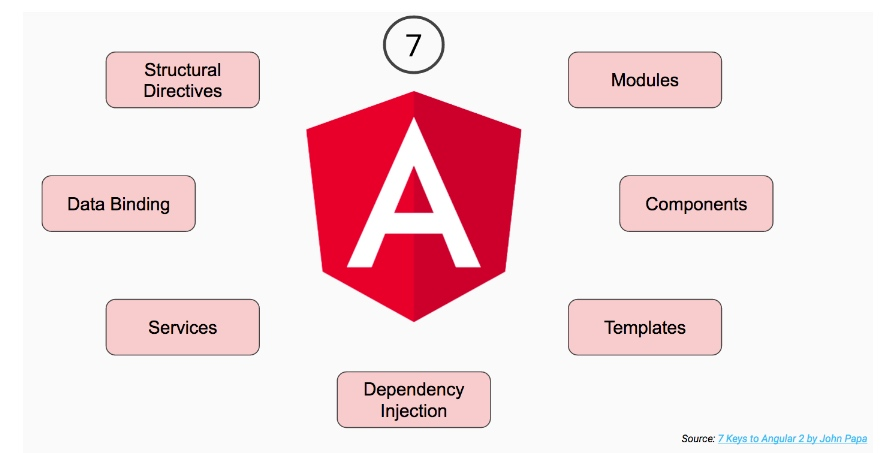
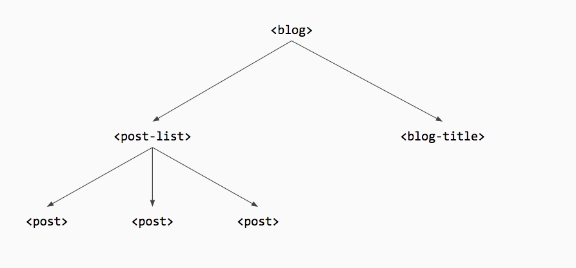
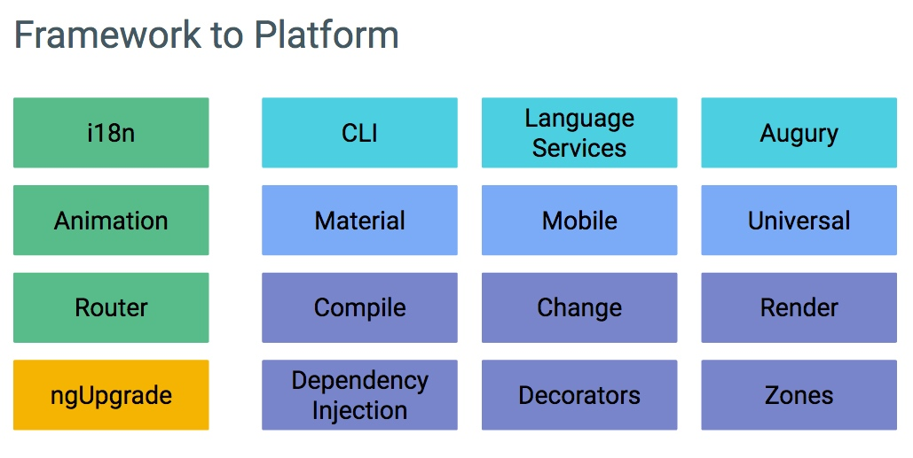
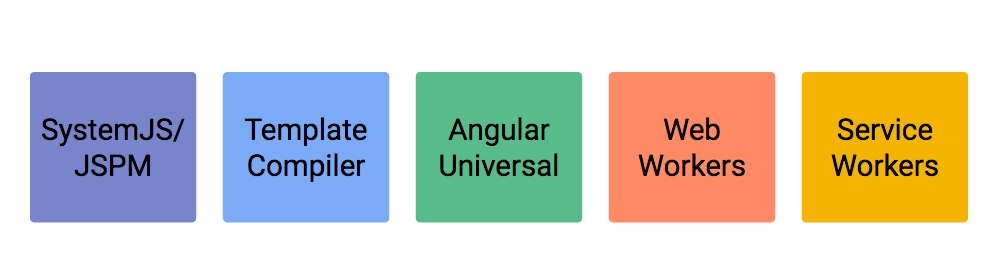
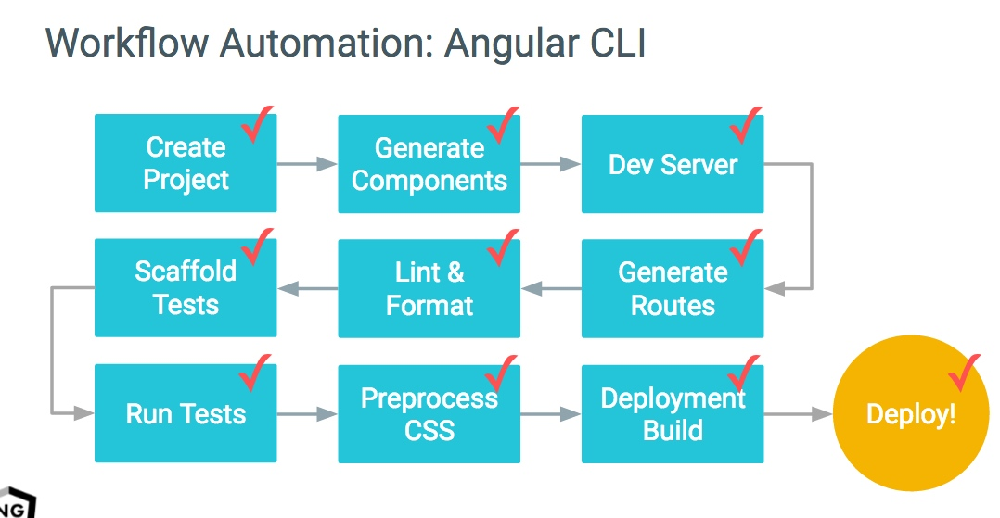

## 1.2 Angular 简介

通过上一节的介绍，我们对近几年 Web 开发现状和趋势有了较为完整的认识。我们了解了很多概念， 诸如 MVC，MVVM，Web Component，Flux，immutable data等等， 这些概念也慢慢地融入到我们的开发实践中。在本章，我们会正式进入 Angular 的讲解。看看 Angular 受到哪些思维的影响 ，以及 Angular 本身如何引领了一代开发风潮。

我们将首先回顾 Angular 的历史，谈谈它怎么先从个人项目 getAngular 转型为 Google 内部流行的官方项目，接着在1.x各个版本迭代引入各种特性，最后我们聊一聊的Angular2的诞生到发布正式版的历程。此外，我们将对 Angular2 的主要特点和概念进行简单讲诉，便于读者在后续章节的详细讲解前有个直观的全局认识。最后，我们会在结尾给出本章的总结。

### 1.2.1 历史回顾

#### getAngular 起源

2009年，Misko Hevery 和 Adam Abrons 在业余时间创造了 AngularJS。起初，它叫做 GetAngular，是个让 Web 设计师和前后端工程师来沟通的端到端设计开发工具。

随后，Misko Hevery 在 Google 内接手 Feedback 的开发，经过6个月将近1.7万行的代码量的功能迭代，代码库越来越大，维护开发变得举步维艰。Misko 找到了他的经理 Brad Green，打赌用 GetAngular 三周的时间重写该项目，把它从原来的1.7万行代码精简到1500行。Brad 十分看好 GetAngular 项目，把它改名为 AngularJS ，在 Google 内组建了团队专职来开发和维护。

后来适逢 DoubleClick 被 Google 收购， AngularJS 被用来重写它的部分业务逻辑， 其效率之高令人称奇，至此 AngularJS 在公司内部一鸣惊人，Google 管理层觉得应该投入更多的人力和资源到 AngularJS 团队上，让他们集中精力开发 AngularJS 框架和周边，并且在公司内外做产品开发，运营和推广。

#### 1.x 的迭代之路

在进入开发快车道后，AngularJS 的版本迭代有条不紊的进行着。

2012年3月，AngularJS 进入1.0.0 发行候选版开发，前前后后的12个rc版本历时3个月，才在6月中旬发布了 1.0.0 temporal-domination。它的改变包括：

- 彻底重写 $compile，支持 Directive 指令的语法（统一 widget，attrWidget，directive 等概念）
- 优化表单/输入控件/双向数据绑定，方便实施数据验证和格式化
- Controller 和 Scope 解耦分离

在1.0版本发布后，核心团队在接下来几个月采用了1.1和1.2同时开发的版本迭代方式，其中1.1开发新功能特性，引入不兼容的改造，待稳定运行发版后合入1.2。

2013年11月，整合了1.1版本功能的1.2 timely-delivery 版本迟迟到来，给我们带来了如下的功能和调整：

- 把 ngRoute 抽取到单独的模块中
- 引入 ControllerAs 语法，使得模板中的数据绑定更加清晰（而不是分不清层级的Scope）
- ngRepeat 支持 trackby 功能
- $http等服务遵从Promises/A+ 标准

同时，Angular团队花了大量时间去优化，简化，提升文档质量和官方文档的浏览体验。

2014年的10月中旬，在 1.3 superluminal-nudge 版本中，AngularJS 宣布了不再继续支持 IE8。同时提供了如下的新功能：

- 单次绑定，在模板中使用 :: 的表达式
- ngMessages 该模块来更好做表单检验消息
- ng-model-options 对 ngModel 更细粒度的控制

> 在同年的4月，微软宣布停止对 Windows XP 系统的支持，这也意味着微软不再支持主要运行于该系统上的IE8浏览器

在15年5月底，Angular 团队终于发布了 1.4 jaracimrman-existence 版本。该版本中有超过400条提交，优化了文档，修改了超过100个bug，新增超30个新特性。包括：

- 重写动画模块，修复大量的遗留bug
- Router模块，为AngularjS和Angular2 提供了强大并且一致的路由方案

在16年2月份，Angular团队又发布了1.5版本，该版本的主题就是要和Angular2做进一步整合，提供更接近于Angular2应用的书写体验。如组件式的开发，定义组件指令，生命周期 Hook 等等

#### 初生的 Angular2

在14年3月份，官方博客就有提及在为新的Angular 做设计和开发，所有的设计文档都公布在 Google 云盘中。博客宣称该框架有以下特点：优先为移动应用设计，更快速的变化检测，模块化引入，新路由采用状态、支持整合认证授权、缓存视图等，有持久化支持离线使用等等。大家为之兴奋不已！

在14年9月下旬的 NG-Europe 大会上，Angular2 首次亮相于众。它的接口和概念变化在很多 AngularJS 开发者中引起了不小的争议。这些变化包括：

- 引入Component，统一控制器和模板，向 WebComponent 标准看齐
- 引入 AtScript，对 TypeScript 和 ES6 语法增强，添加可选运行时类型和Annotation（类似Java的标注）来帮助大型团队开发复杂应用和更好的文档化支持
- 移除 Scope 概念
- 使用新的路由模块等

这些大的改变抛弃了 AngularJS 这几年来的一些历史包袱，让经验老到的开发团队能够重新设计，结合老 Angular 的经验教训和外界引入的思潮（如 React 的日益流行，以 Virtual DOM 分离出的渲染来获得性能提升和平台扩展性，向 Web Component 的标准看齐）。不过这些激进的转变让1.x的开发者感到不习惯，很多人开玩笑说『现在用 AngularJS 1.x 这个注定很快要淘汰的框架开发业务代码...』，但从长久看上看，尽管当时被各种抨击，但这个破釜沉舟的决定还是非常正确的，它成就了 Angular2 现在的高性能，高开发效率，丰富扩展能力的特点。

在15年的4月30号，Angular 团队宣布它从最初的 alpha 版本转到开发者预览版中。

同时官方也先后引入了 ngUpgrade 和 ngForward，支持向现有的Angular 1.x 应用中集成Angular 2的代码，也为从Angular 1.x到Angular 2的迁移提供了解决方案。

#### 新的勃勃生机

通过 alpha 版本和开发者预览版，Angular 团队和Google内部多个大项目组的同事紧密配合，也在真实项目需求中检验着Angular2，包括了 AdWords 广告团队, GreenTea 内部客户关系管理软件的团队，Google光纤团队。事实上，2015年底，Google 光纤产品上线，背后的代码库就是以 Angular2 代码为基准的。

在2015年12月，Angular2 开始进入 beta 版本。多个外部组开始整合以适应新的 Angular2。如 Ionic 框架推出 ionic2 计划，Telerik 加紧对 NativeScript 的整合，Rangle.io 着手开发 Batarangle 开发者工具等。同时Angular.io 官网正式上线，扩充了快速开始文档的内容，添加入门教程、开发者指南、参考手册等文章，开发者可以跟着文档一步步体验并使用 Angular2。

16年5月，Angular2发布rc1版本，正式进入发行候选阶段。 6月中旬发布rc2版本，变化包括：

- 动画框架引入状态化书写的方式，底层支持多平台
- 表单提升，引入更清晰的指令和对象名称，包括ngModelGroup, FormGroup() 等
- 合入了超过100项社区贡献的代码，减少需等待合入PR申请

一周后，rc3版本发布。该版本把新路由项目合入主代码库中（但它仍然会保持自己的版本号和发布迭代周期。

> TODO 继续跟进
> 最近又发布了新版本，RC4
> 另一点可以提一下，Angular2上周刚上线了中文官网。网址是angular.cn

#### 开发语言之选

优秀框架的开发离不开强大的编程语言，尤其像是 Angular 这样的大型框架。在 Angular 框架开发之路上，使用过 Dart，AtScript， TypeScript 这三类 JavaScript开发语言。可以看到在严谨工程实现上，对语言的特性和功能的要求都是苛刻的。

Dart，这门被 Google 寄予厚望的用于替代 JavaScript 而开发的编程语言。在Google内部通过把 AngularJS 用 Dart 重写来试用检验 Dart 语言。这个重写项目叫做 AngularDart，它是 Hevery 在14年一直在忙的项目。非常有意思的是，根据 Google 团队说，AngularDart 项目效果出乎意料的好，因为这让核心团队能够接触和产生很多新的想法，譬如最早借鉴于 Dart 而引入的 Zone.js等特性。在 Angular 2开始后，从最早的编译到Dart方案，到正式版发布前的独立代码仓库（不满意之前的编译状态和fix bug速度）。

AtScript 基于 JavaScript，并且扩展了微软的 TypeScript，也是一门最终转译到 JavaScript 的脚本语言。它最早在2014年的 ng-Europe 大会上被 Google AngularJS 核心开发人员宣布为后续 2.0 版本的主要构建语言。 起初 AtScript 被设计运行在 TypeScript 之上，同时从 Dart 引入一些新的有用的特性。

不过在2015年3月的盐湖城会议上，微软 TypeScript 和谷歌 Angular 开发团队一起宣布了会把 AtScript 中不少新的特性功能在 TS 的1.5版本中发布，同时 Angular2 将仅仅用 TypeScript 。这是影响业界的大事，强大框架和语言的珠联璧合，给Web前端开发带来了新的可能。

#### 工具周边和生态

从工具到平台，伴随着的是周边生态和相关工具的不断涌现和完善发展。

### 1.2.2 Angular 简述

在本小节我们会进一步走近 Angular2，从7大核心概念看其背后的设计亮点，通过分析其从框架到平台的演进过程中，观察发展趋势。

#### Angular 核心概念

Angular 框架的关键理念有如下7个部分，它们是驱动 Angular 的核心。

- 模块

在 Web 开发中，我们通过依赖全局状态/变量，和保证引入 JavaScript 文件顺序来正确加载我们的类库。比如说： $ 代表着 jQuery，当在引入 $.superAwesomeDatePicker 类库来实现日期选择控件前，需要确保 jQuery 已经正常载入。随着我们的程序越来越大，文件切分越来越细，就会需要一个成熟的模块系统（之前的AMD，CommonJS等）来帮忙我们管理依赖。在新的语言标准中，我们有了 import 来导入在其他文件中定义的模块，且用 export 导出的诸如 jQuery 或 moment 这样的依赖到我们的业务代码模块中，后续的 TypeScript 章节中会对该语法进行更详细的讲解。还需要注意的是，TypeScript 的语言特性还给我们带来了Class 类，Inherit 继承和 Annotation 注解（它为底层的 Angular 框架提供了元数据信息）

- 组件

以组件为基础的架构模式是现在 Web 前端开发中的主流的方式。不仅仅在 Angular 中，在类似的 React， Ember 或 Polymer 等框架中也是很常见的。这种开发方式就是构建一个个小的组织代码单元，每个代码单元职责定义清晰，并且可以在多个应用中被复用。举例来说：如想使用 Google 地图组件，就在页面引入 <google-mappointer="46.471089,11.332816"></google-map> 这样语义化的标签。

Angular2 全面支持这样的开发方式，在 Angular 中，组件是第一等的公民。伴随组件而来的是组件树的概念。每个 Angular2的程序都有一个组件树，由应用组件或者叫顶层的根组件和许多子组件和兄弟组件组成。组件树是很重要的概念，后续章节还会继续讲解。它有很多作用，如它会展示出你的 UI 界面是怎么组成的，这样的结构图也体现了一个组件到另一个组件间的数据流动。Angular也依赖于此做出合适的变化检测策略。

> 变化检测是 Angular 在应用的数据变化后，用于决定哪个组件需要随之刷新的机制。

- 模板和数据绑定

当我们使用组件标签的时候，当然需要在某处去定义让 Angular 渲染显示的内容。通过类似于 template 或 templateUrl 属性来用 HTML 来描述界面内容。 我们需要数据绑定机制来实现把数据映射到模板上或者从模板（如input控件）中取回数据。

- 服务和依赖注入

在 Angular2 中，如果说组件是用于处理界面和交互相关的，那么服务就是开发者用于书写和放置可重用的公共功能（如log处理，权限管理等）和复杂业务逻辑的地方。服务可以被共享从而被多个组件共同使用。一个服务就是一个简单的 ES6 的类。通常我们在组件中引用服务来处理数据和实现逻辑。那么我们在引用前，在哪里初始化它呢？ 通过对实现服务的类加上 @Injeactable注解标注，同时把它注册到 provider（可以在应用，根组件，或需要注入服务的上层组件中实施）

### Angular 从框架到平台

Angular 的项目经理 Brad 说过 Angular2 现在更像是一个平台而不是简单的类库或者单一的框架。它从最早的大而全的代码切分为多个模块化的部分，并在此之上构建其他好用的工具。

框架核心包含：

- 依赖注入
- 装饰器支持
- zone.js
- 编译服务
- 变化检测
- 渲染引擎

其中，zone.js 可以独立于Angular使用在其他地方，并且已经提交TC39考虑进入ECMA的标准。而渲染引擎也是平台独立的，从而可以方便实施为桌面软件和原生的移动客户端中。

在此之上还有不少外部工具库，其他类似于：

- Angular  Material（Material设计风格的UI组件库）
- Angular Mobile Toolkit（提供工具和技巧来开发高性能的移动移动）
- Angular Universal（实现后端渲染来加速首屏渲染和实现搜索引擎优化）等

除了这些外，Angular周边也有完善的工具体系：

- CLI提供了一套把工作流自动化从创建项目，到生成脚手架如组件，路由配置，启动开发服务器，生成测试脚手架，lint和格式化，运行测试，预处理CSS样式，部署前的构建等等
- 语言服务是由 Angular 采用 TypeScript 构建所以类似于在IDE中完善的代码补全，语法检查报错，定义跳转，方法提示等等，从而显著提升开发效率和编译运行前的错误发现
- Augury（之前叫 Batarangle）它是用于调试和性能分析的开发者工具，可视化查看应用的组件树和定位问题

当然为了开发强大应用，Angular 在功能开发上也提供了不少辅助模块。如：

- i18n 用于语言国际化，字符时间等本地化
- 用于构建多界面的 SPA 的路由系统（从两三年前一直跌到到现在破釜沉舟的3.0）
- 动画模块提供了基于声明式的书写体验和完善钩子节点的功能。

这些模板都是可以同时在1.x和2.0同时使用的，减少开发者的迁移成本。Angular2 和 AngularJS 1.x 不是孤立的，通过 ngUpgrade，ngForward 两个模块能够从今天在1.x开发的应用仓库中就立即使用上2.0的功能，面向未来编码。

### Angular 特点

我们先后看了 Angular 核心概念和 Angular 平台提供的各式各样的功能，那么 Angular 相对于其他前端技术有什么特点呢？

它拥有超快的性能：

- 渲染速度优化，包括更快的变化检测，内部的性能基准测试框架
- 视图缓存从而实现流畅的虚拟滚动和丝滑的页面切换。
- 通过服务端渲染实现更快的首屏加载，更小的启动库网络加载更快
- 更好的响应性在移动端上（原生支持各种手势，触摸等

它对开发支持更完善：

- 提供的 CLI 帮助开发更快脚手架和流畅的开发工作流
- 通过 augury 可视化的查看应用状态和 Angular 内部
- 通过 TypeScript 使得严肃工程化编程得以实施
- 官方支持的代码风格向导和检查 - lint/style 工具

它的社区和周边也强大多样：

- 官方级别的 Material Design 和其他UI库
- 可以通过 mobile toolkit，ionic2，nativescript/react native 开发h5，混合应用和原生应用
- 结合Meteor，实现全栈式开发和高效整合。

这就是你应该立即应该用上 Angular2 的原因了！

### 1.2.3 小结

通过本章的学习，我们对 Angular 有了较为直观的认识。清楚了它历史发展的一步步轨迹，也明白了 Angular2 这个怪胎成长为根正苗红欣欣向荣的大平台的故事。Angular 的内核包括了模块，组件，模板数据绑定，服务，依赖注入，注解等这些概念来实施应用开发，它的平台也提供了各种辅助周边，功能模块，效率开发工具等，最终形成了我们性能强劲快速，开发体验完善，社区和周边强大的 Angular2。

在下一章，我们会学习 TypeScript 语言，它是构建 Angular 框架的基石语言，也是官方推荐的开发语言。那么，我们继续吧~
