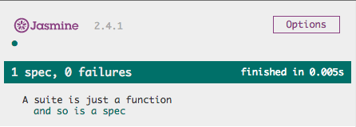
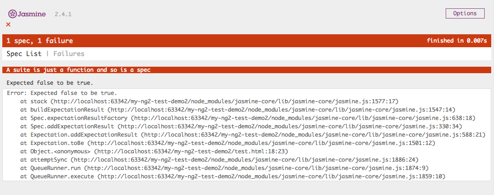
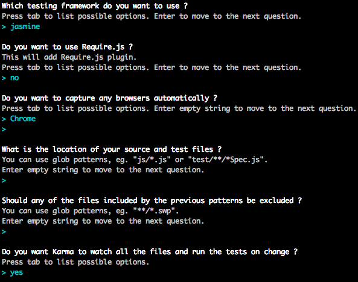
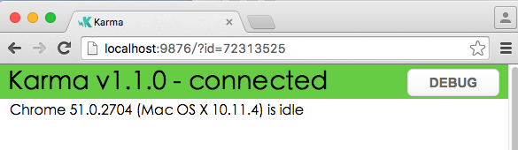
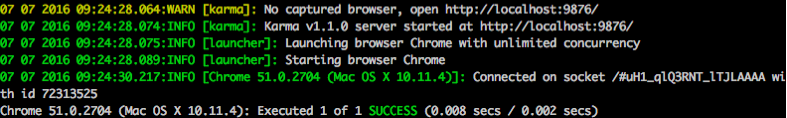
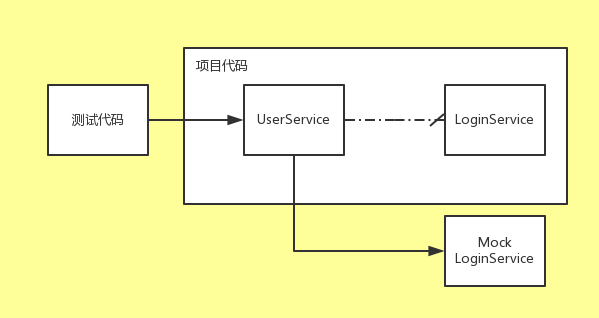

通过前面章节的学习，相信你已经掌握用Angular2开发一个应用的语法及基本技能。一个应用，仅仅只是开发好了，是远远不够的，还需要有稳定的质量及快速迭代开发的能力。此时，你需要进一步学习测试技术及相关工具，以保证应用的质量。从Angular1.x 到 Angular 2，Angular团队都非常重视可测性，通过Angular构建的应用，可以更加游刃有余地编写单元测试及集成测试代码，同时，业界也有丰富、开源的测试框架，有效地提高了测试生产力。本章就将为你介绍测试相关的内容。

# 8.1 概述

## 8.1.1 为什么要测试

毫无疑问，任何代码都需要良好的测试。对于一个应用来说，其意义体现在：

- 应用如果没有稳定的质量，bug层出不穷，很容易让用户失去使用的兴趣，从而失去用户的口碑。
- 在开发过程中，如果能辅以合理高效的测试手段，将事半功倍，提升开发效率，例如，可以通过持续集成＋自动测试的方式，及时暴露每日新代码的缺陷；代码重构后，可以迅速进行功能验证。
- 完备的测试代码，对于项目来说，是天然、优秀的说明文档。项目新加入的开发同事，通过阅读测试代码，可以很清楚地了解各个功能模块的关系、逻辑、调用方式。

## 8.1.2 概念：单元测试、端对端测试

无论在哪种编程语言下开发，最基本的测试无非两种，一种为单元测试，另外一种则为端到端（e2e，集成）测试。

单元测试，顾名思义，就是对程序中的某个单元做测试，这里所指的单元，往往是指一段代码，一个函数等等，而非一个大型的功能集合。而端到端测试，可以简单概括为“模拟用户视角”进行测试，模拟用户行为进行测试，用户会怎么用这个系统，你就怎么测，当然，为了测试的全面性，测试往往覆盖并超过大部分用户的使用路径。

## 8.1.2 Angular测试技术及工具一览

工欲善其事，必先利其器。适用于Javascript的测试框架有很多，常见的包括mocha、jasmine、qunit等。不过无需担心”选择恐惧症”问题，这些框架，其实都非常相似，Angular团队推荐采用jasmine。另外，为了更好地管理测试工程，在浏览器上运行用例，还需要引入类似karma这种测试过程管理工具。对于端对端测试，则推荐使用Protractor。下面的章节，将主要介绍 Karma 、Jasmine 、Protractor的基本使用方式，以及如何结合Angular2写测试代码。

> 本章的探讨方向是如何写好测试代码，也就是自动化测试，而非传统的手工测试。因此，内容基本也是围绕一些测试框架展开。手工测试相关的技术，不在本章的讨论范围。

# 8.2 单元测试

## 8.2.1 单元测试

### 简介

诚如前文所述，单元测试一般都是对程序中某个独立、小型的代码块进行测试，它可能是一个函数，一个类，而非一个完整的系统。单元测试通常是由开发人员负责，以便在开发、重构过程中及时发现程序中的bug。

单元测试是研发过程中必不可少的一个环节，其好处在于：

1. 帮助开发人员在更早的阶段（开发、甚至是架构设计阶段）发现问题，而越早发现问题，往往也意味着越小的问题修复成本。
2. 自动化测试。可以快速、反复地对bug、代码逻辑进行验证，提高代码重构后验证逻辑的效率。
3. 良好的单元测试，也是天然、上佳的软件文档。
4. 单元测试帮助我们从另一个角度审查所开发的代码，一个项目，如果写单元测试代码时捉襟见肘，处处受限，往往也意味着项目本身的代码可测性不好，解藕程度不够，设计需要进一步优化。

> 下面的8.2.2及8.2.3小节，将抛开Angular2 ，向Javascript开发者介绍如何使用Jasmine及Karma。8.2.4小节，则将结合Angular2进行介绍。如果你已经比较熟悉Jasmine及Karma，也可以选择跳过8.2.2及8.2.3小节。

### 基本法则

在热火朝天地学习angular2测试前，先讨论怎样的单元测试，是良好、可持续维护、高质量的单元测试代码。建议可以遵从以下规则：

1. 尽量将代码切分成小的可测单元

   这要求项目中的代码，逻辑、分层都要足够清晰。所幸，你用的是angular2！angular2从设计之初就追求可测性，按照angular2规范写的代码，往往都是可测性较好的组件，因此，单元测试需要对这些组件都进行测试。

2. 尽量只测试公开接口

   这样可以保证，被测代码的变更，不会轻易影响到测试代码。当代码实现细节、私有接口发生改变时，单元测试依然是跑得通的（也许会跑失败，不过这不正是单元测试的作用之一，代码重构后迅速发现问题）。这也能使单元测试代码成为天然的文档，当别人阅读单元测试代时，就能知道如何正确地使用对应的组件。

3. 多运行单元测试

   写了单元测试，就要多运行，确保单元测试时是能正常运行的，而且在测试失败时，能给出足够的信息帮助调试者定位问题

## 8.2.2 常用的测试框架

单元测试说简单点，就是验证被测的单元，在不同的输入条件下，执行的结果是否和预期一致。就像使用Angular2作为web框架，以提高开发效率一样。这时候，往往需要测试框架来提高写单元测试的效率，帮助开发人员快速验证输出是否符合预期。当用例规模逐步增大时，测试工程会面临更多问题：需要将用例进行分组，以方便管理；能够快速运行测试用例，然后以一个友好的界面展示测试的结果，覆盖率等等。Javascript的世界里，相关的测试框架及工具也非常强大，下面，就进入本章的正题，学习如何结合框架、工具，编写测试代码！

#### Jasmine

Jasmine是一款行为驱动的测试开发框架，可以用来测试任意的Javascript代码。也就是说，无论是Web项目，还是Node后台项目，都可以用Jasmine来写测试代码。测试代码，无非就是通过代码指定一系列输入，然后再判断输出是否满足预期。Jasmine提供灵活强大的语法，让这些代码的编写更加简单。Jasmine也是Angular团队推荐的一个测试框架，Angular2甚至基于Jasmine扩展了一套测试语法，集成在@angular/core包中(后面将介绍)

##### 安装

1. 安装Node.js及npm
2. 建好项目目录，并安装Jasmine核心库
```shell
npm install jasmine-core --save-dev
```

> `--save-dev`表示在当前项目的开发模式下安装npm包。与之对应的`--save` 则表示在产品模式下安装，产品在最终发布打包时也会带上这些npm包。

##### 第一个例子

安装好`jasmine-core`后，当前路径会生成子目录node_modules/jasmine-core。创建一个空的html，命名为test.html ，然后输入以下内容：

```html
<!DOCTYPE html>
<html lang="en">
<head>
  <meta charset="UTF-8">
  <title>NG2 单元测试</title>
  <link rel="stylesheet" href="node_modules/jasmine-core/lib/jasmine-core/jasmine.css">
  <script src="node_modules/jasmine-core/lib/jasmine-core/jasmine.js"></script>
  <script src="node_modules/jasmine-core/lib/jasmine-core/jasmine-html.js"></script>
  <script src="node_modules/jasmine-core/lib/jasmine-core/boot.js"></script>
</head>
<body>
  <script>
    //一个简单的测试代码
    describe("A suite is just a function" ， function() {
      var a;
      it("and so is a spec" ， function() {
        a = true;
        expect(a).toBe(true);
      });
    });
  </script>
</body>
</html>
```

test.html展示了一个最简单的例子，用浏览器打开这个html文件，将执行html中的测试代码，你将看到如下界面，也就是这个测试用例的执行结果。

 

这段示例代码虽然非常简单，但展示了用jasmine写测试的基本方法：

1. 在`head`标签中，需要引入了3个js文件和1个css文件。这是Jasmine的库文件。
2. `describ(string ，function(){})`函数是Jasmine的核心函数之一，用于定义一个测试集。第一个参数表示该测试集合的名称，第二个参数是个函数，在该函数中定义测试集合的细则。
3. 一个测试集下可以包含多个用例，每个用例用`it()`函数定义，类似的，第一个参数为用例名称，第二个参数则定义了用例的详情。
4. 在`it()`函数中，需要用expect断言函数来判定测试结果，例如，`expect(a).toBe(true)` 表示变量`a`应等于true，否则，则说明这个用例测试失败。

简单验证下测试出错的情形，把例子中的`a=true`改成`a=false`，此时刷新test.html页面，显示出错页面如下所示： 

##### 内置匹配器

匹配器，就是跟在expect()函数后面，判定结果是否符合期望值的函数。在前面的例子中，已经用到了一个很常用的匹配器`toBe()`。下面将对Jasmine内置的匹配器做一下梳理：

1. `toBe()`本质是使用操作符===来比较结果值和期望值，`not.toBe()`则表示 不等

   ```javascript
   it("The 'toBe' matcher compares with ===" ， function() {
    var a = 12;
    var b = a;

    expect(a).toBe(b);
    expect(a).not.toBe(null);
     });
   ```

2. `toEqual()`用于比较两个对象，可以是自定义的对象类型（如下面的例子），也可以是数字、字符串等等。

   ```javascript
   it("should work for objects" ， function() {
         var foo = {
           a: 12 ，
           b: 34
         };
         var bar = {
           a: 12 ，
           b: 34
         };
         expect(foo).toEqual(bar);
    });
   ```

3. `toMatch()`用于验证是否匹配正则表达式

   ```javascript
     it("The 'toMatch' matcher is for regular expressions" ， function() {
       var message = "foo bar baz";

       expect(message).toMatch(/bar/);
       expect(message).toMatch("bar");
       expect(message).not.toMatch(/quux/);
     });
   ```

4. `toBeDefined()`用于验证对象是否为`undefined`

   ```javascript
     it("The 'toBeDefined' matcher compares against `undefined`" ， function() {
       var a = {
         foo: "foo"
       };

       expect(a.foo).toBeDefined();
       expect(a.bar).not.toBeDefined();
     });
   ```

5. `toBeNull()`用于验证对象是否为 `null`

   ```javascript
     it("The 'toBeNull' matcher compares against null" ， function() {
       var a = null;
       var foo = "foo";

       expect(null).toBeNull();
       expect(a).toBeNull();
       expect(foo).not.toBeNull();
     });
   ```

6. `toBeTruthy()`用于验证对象是否为`true`，相应的，还可以用`toBeFalsy()`验证是否为`false`

   ```javascript
     it("The 'toBeTruthy' matcher is for boolean casting testing" ， function() {
       var a ， foo = "foo";

       expect(foo).toBeTruthy();
       expect(a).not.toBeTruthy();
       expect(a).toBeFalsy();
       expect(foo).not.toBeFalsy();
     });
   ```

7. `toContain()`用于验证数组是否包含指定元素

   ```javascript
     it("The 'toContain' matcher is for finding an item in an Array" ， function() {
       var a = ["foo" ， "bar" ， "baz"];

       expect(a).toContain("bar");
       expect(a).not.toContain("quux");
     });
   ```

8. `toBeLessThan()`用于验证结果是否小于指定值，相反的，用`toBeGreaterThan()`验证结果是否大于指定值

   ```javascript
     it("The 'toBeLessThan' matcher is for mathematical comparisons" ， function() {
       var pi = 3.1415926 ，
         e = 2.78;

       expect(e).toBeLessThan(pi);
       expect(pi).not.toBeLessThan(e);
     });

     it("The 'toBeGreaterThan' matcher is for mathematical comparisons" ， function() {
       var pi = 3.1415926 ，
         e = 2.78;

       expect(pi).toBeGreaterThan(e);
       expect(e).not.toBeGreaterThan(pi);
     });
   ```

9. `toBeCloseTo()`是将值进行四舍五入后比较是否相等，函数中的第二个参数为四舍五入的数字精度

   ```javascript
     it("The 'toBeCloseTo' matcher is for precision math comparison" ， function() {
       var pi = 3.1415926 ，
         e = 2.78;

       expect(pi).not.toBeCloseTo(e ， 2);
       expect(pi).toBeCloseTo(e ， 0);
     });
   ```

10. `toThrow()`将检验函数是否会抛出一个错误，还可以用`toThrowError()`验证具体的错误类型

    ```javascript
      it("The 'toThrow' matcher is for testing if a function throws an exception" ， function() {
        var foo = function() {
          return 1 + 2;
        };
        var bar = function() {
          return a + 1;
        };

        expect(foo).not.toThrow();
        expect(bar).toThrow();
      });

      it("The 'toThrowError' matcher is for testing a specific thrown exception" ， function() {
        var foo = function() {
          throw new TypeError("foo bar baz");
        };

        expect(foo).toThrowError("foo bar baz");
        expect(foo).toThrowError(/bar/);
        expect(foo).toThrowError(TypeError);
        expect(foo).toThrowError(TypeError ， "foo bar baz");
      });
    ```

#### Karma

Karma是一个基于Node.js 的 JavaScript 测试执行过程管理工具(Test Runner)，也是由Google Angular团队出品。

 它主要带来了这些强大的特性：

- 在真实浏览器上测试。前端测试的一个目标，就是关注代码在不同浏览器的表现，检查是否有兼容性问题。Karma可以同时启动chrome、safari等不同的浏览器，并在一个浏览器窗口展示各个浏览器的测试结果。
- 当代码更新时，自动触发测试。在开发过程中，如果被测代码或者测试代码发生了变更，就能自动触发测试，这样新代码能马上得到自动验证，而且不用在多个编辑区、窗口之间切换。
- 丰富的插件支持。借由karma的各类插件，可以很方便地扩展功能，如生成友好的覆盖率报告、webpack、system.js代码打包等等。

对于几个测试用例的小demo工程，karma也许显得大材小用，但随着项目规模逐渐变大，一款值得信赖，强大的测试管理工具，将为你解决编写测试代码之外的很多烦心之事。

##### 安装

```shell
#以便全局都可以运行karma的命令行
npm install -g karma-cli
#安装karma
npm install -g karma
#本章会讲如何结合jasmine进行测试，因此需要安装jasmine相关插件
npm install -g karma-jasmine karma-chrome-launcher
```

## 8.2.3 karmai+jasmine的简单示例

为了帮助读者快速理解、结合karma及jasmine进行测试，这里将展示一个简单的例子

##### 1.安装karma

在系统全局安装karma，这样才能在命令行窗口下执行karma命令

```shell
npm install -g karma
```

##### 2.初始化karma.conf.js

在项目根目录下执行以下命令

```shell
karma init
```

这个命令将启动karma的配置生成器，生成器将依次询问要使用的配置，此时简单处理，可以一直按回车键，使用默认配置即可，最终将在本地生成karma.conf.js。相关界面如下图所示

 

##### 3.配置、安装依赖包

在根目录创建package.json，然后填入以下内容

```json
{
  "name": "test" ，
  "scripts": {
    "test": "karma start karma.conf.js"
  } ，
  "devDependencies": {
    "jasmine": "^2.4.1" ，
    "jasmine-core": "^2.4.1" ，
    "karma": "^1.1.0" ，
    "karma-chrome-launcher": "^1.0.1" ，
    "karma-jasmine": "^1.0.2"
  }
}
```

这是一个简单的配置文件，用于通过npm管理项目、配置依赖，其中：

- `"test": "karma start karma.conf.js"`表示为｀karma start karma.conf.js｀命令创建了一个别名`npm test`，运行 `npm test`等于运行｀karma start karma.conf.js｀
- devDependencies中则为karma及jasmine的依赖包

然后执行`npm install`安装package.json上指定的依赖包

> 前面章节已经介绍过package.json，每一个使用npm来管理依赖包的工程，都会存在这个文件

##### 4.写测试用例

在根目录创建一个被测代码文件，命名为src.js，这个js包含了一个简单的函数，验证参数是否为string类型

```javascript
function isString(s){
   return typeof(s) === "string";
}
```

在同级目录创建一个测试用例文件，命名为test.js，然后输入以下内容

```javascript
describe("A suite of string util" ， function() {
    it("is string" ，function(){
        expect(isString("ss")).toBeTruthy();
        expect(isString(1)).toBeFalsy();
    });
});
```
##### 将测试代码路径加到karma.conf

在karma.conf.js中配置测试及被测代码的路径，这里可以用通配符的方式，新加入配置如下：

```json
files: [
	'*.js'
] ，
```

修改后的karma.conf.js如下所示

```json
module.exports = function(config) {
  config.set({
    basePath: '' ，
    frameworks: ['jasmine'] ，
    files: ['*.js'] ，
    exclude: [] ，
    preprocessors: {} ，
    reporters: ['progress'] ，
    port: 9876 ，
    colors: true ，
    logLevel: config.LOG_INFO ，
    autoWatch: true ，
    browsers: ['Chrome'] ，
    singleRun: false ，
    concurrency: Infinity
  })
}
```

上面是一段经典的karma配置，其中需要理解的配置项包括：

`frameworks: ['jasmine']`指定了使用`jasmine`作为测试框架

`browsers: ['Chrome']` 表示在chrome浏览器上运行测试用例。你也可以指定其它浏览器，如safari等等

`files: ['*.js']:` 指定了测试和被测代码的路径。因为本例中的测试及被测代码，文件名后缀均为.js，且都放在根目录上。因此`['*.js']`这个配置，将使karma引入这两个文件，并执行其中的测试用例。

##### 5.运行测试用例

最后，执行`npm test`

karma会自动打开一个chrome浏览器，显示以下内容

 

稍等一会，命令行窗口将出现以下信息，在最后一行，可以看到成功执行了一个用例，结果为SUCCESS(成功)



综上所述，配置一个karma＋jasmine的“测试全家桶套餐”，只需要：

1. 安装karma并通过`karma init`命令初始化karma配置文件
2. 往package.json添加karma及jasmine依赖
3. 用jasmine语法写测试用例

是不是很简单呢？

## 8.2.4 Angular2 下的单元测试

### 学习路线

在前文中，已经提到，Angular开发团队，从研发angularjs1.x到Angular2，都特别注重可测性。在Angular2中，组件化、依赖注入、使用ECMAScript 2015/2016特性等设计理念，使其单元测试更加便捷。对angular2的程序进行单元测试，学习路线是：

1. 首先，angular app下的每个组件，都是一个个JS类（ class ClassName {xxx})，而不是像老旧的web项目一样，都是一堆松散的function。因此，你可以像测试普通js代码（或者更准确地说，普通的js 类）一样，测试js 类中的逻辑：在测试代码中初始化被测类，然后调用被测类中的函数，验证函数返回值。
2. 其次，需要学习Angular团队提供的测试工具组件。为了更好的测试compoent中的交互、展示逻辑，也许你需要学习使用`TestComponentBuilder` ，为了更好的测试servcie，解决依赖注入的问题，还需要学习使用`addProviders`注入测试代码中需要引用的service，使用`async`api验证耗时的异步请求，学习如何mock service。
3. 最后，根据项目前端打包工具的不同，有些项目可能用的是webpack，有些可能是用system.js。还需要学习如何将webpack，system.js和karma整合，构建一个完整、可持续维护的测试工程。

### Angular2单元测试基本配置

前面已经描述过如何开始一个jasmine＋karma的测试工程，这里不再进行赘述，将介绍如何对Angular的关键组件进行测试

### 准备

#### import基础测试组件

在开始写测试代码之前，需要在测试代码开头引入测试组件，常用的import大致如下：

```javascript
import {
  iit ，
  it ，
  ddescribe ，
  describe ，
  expect ，
  async ，
  inject ，
  beforeEachProviders
} from '@angular/core/testing';
import {
  TestComponentBuilder ，
  ComponentFixture
} from '@angular/compiler/testing';
```

`it` ，`describe` ，`expect`这几个组件，是不是很熟悉呢?Jasmine也有这些组件，但angular2在Jasmine基础上扩展了一些测试组件，api、用法和Jasmine基本一致。angular团队之所以也实现了一套测试工具组件，主要是因为angular2依赖注入的特性，因此需要做一些扩展，以满足angular2的测试需求。具体的用法，下面会讲到。除此之外，在每个测试用例代码中，当然也要引入被测的组件。

#### 在测试用例中注入依赖的组件

由于angular依赖注入特性，在angular的测试代码中，与其它的jasmine测试代码一个很大的区别，就是需要在用例中注入所引用的组件。下面展示了一个简单的依赖注入的例子，在测试用例中，需要引用angular的APP_ID这个组件，因此，需要在用例代码中，使用inject([APP_ID] ， (id) => {})将APP_ID注入到用例代码中，且指定了引用别名为`id`

```javascript
import {
  it ，
  describe ，
  expect ，
  inject
} from '@angular/core/testing';
import {
  APP_ID
} from '@angular/core';


describe('default test injector' ， () => {
  it('should provide default id' ， inject([APP_ID] ， (id) => {
    expect(id).toBe('a');
  }));
});
```

#### 扩展Jasmine适配器

在前面的章节中，已经介绍过jasmine 一些基本的适配器，但实际测试中，可能需要扩展一些自己的适配器。可以通过jasmine的 `addMatchers`方法进行扩展，例如下面的示例中，扩展了一个函数，用于检测目标元素中是否包含指定的文本信息：

```javascript
beforeEach(() => {
    jasmine.addMatchers({
        toContainText: function() {
            return {
                compare: function(actual ， expectedText) {
                    var actualText = actual.textContent;
                    return {
                        pass: actualText.indexOf(expectedText) > -1 ，
                        get message() { return 'Expected ' + actualText + ' to contain ' + expectedText; }
                    };
                }
            };
        }
    });
});
```

> `beforeEach`函数，就是在每个用例执行前，都要执行的通用逻辑

### 测试component

component是Angular app中最重要的组成部份。每一个compoent，其逻辑都是封装在类中，因此，测试一个简单的component，跟测试普通的javascript 类没什么不同。让我们从经典的“hello world”开始吧！假设有comonent如下：

```javascript
@Component({
  selector: 'app' ，
  template: '<span>{{hello}}</span>'
})
export class App {
  private hello: string = 'Hello';
}
```

那么，对应的测试代码如下，先初始化new 一个对应的类，然后验证类的私有变量`hello`是否等于预期值

```javascript
import {App} from './app/hello';

describe('App' ， () => {

  //步骤1
  beforeEach(function() {
    this.app = new App();
  });

  //步骤2
  it('should have hello property' ， function() {
    expect(this.app.hello).toBe('Hello');
  });

});
```
可以看到，这个过程，跟测试普通的js class并无二致，这时候，如果被测类中新增一个函数，也是同样的测试方式。

假设新增了`getHelloStr()`函数，那么对应的测试代码可以是:

 `expect(this.app.getHelloStr()).toBe('xxxx')`

> 假设被测compoent依赖于其它组件，在测试代码中，还需要注入对应的组件，具体方式和service，可以参考下面“测试servcie”相关内容

#### TestComponentBuilder

上面只是介绍了测试compent 类的方式，更多复杂的测试需求，得借助`TestComponentBuilder`实现，例如，测试html输出，具体的交互逻辑。

顾名思义，TestComponentBuilder，作用在于帮助开发者测试component，构建用于测试component的上下文环境。

先直接展示一个例子，在下面的例子中，通过`TestComponentBuilder`初始化了被测组件`GreetingComponent`，然后可以拿到组件对应的dom元素，并检查dom元素的内容。

```javascript
beforeEach(inject([TestComponentBuilder] ， (tcb) => {
  builder = tcb;
}));  

it('should ask for PIN' ， async(() => {
    builder.createAsync(GreetingComponent).then((fixture: ComponentFixture<GreetingComponent>) => {
      fixture.detectChanges();
      var compiled = fixture.debugElement.nativeElement;
      expect(compiled).toContainText('Enter PIN');
      expect(compiled.querySelector('h3')).toHaveText('Status: Enter PIN');
    });
  }));
```

在上面的例子中，需要理解的内容包括：

- TestComponentBuilder的api`createAsync`用于初始化被测的组件，并创建ComponentFixture对象，这个对象可以认为是被测组件的上下文环境，通过它，可以获取初始化好的组件实例，dom元素等等。
- fixture.detectChanges()用于触发js变量及模版内容的变更。组件初始化、dom元素变更、js值变化时，都需要调用这个方法，以便触发双向绑定的地方做对应变更（todo:还不是特别明确这个的作用）
- fixture.debugElement.nativeElement：获取组件对应的dom元素，之后可以通过`querySelector`等api做进一步处理。
- fixture.debugElement.componentInstance：获取组件对应的js实例，例如假设被测类存在内部变量greeting时，则可以通过`fixture.debugElement.componentInstance.greeting`访问、修改该变量。


#### 更多技巧

- 在测试component的时候，往往每个用例都需要注入TestComponentBuilder，可以用如下的方式，统一注入，而不是在每个用例中逐个注入

```javascript
beforeEach(inject([TestComponentBuilder] ， (tcb) => {
  builder = tcb;
}));
```

- 触发点击事件：cfixture.debugElement.nativeElement.querySelector('button').click()，如例子所示，将获取button子元素，并触发click事件。


- 替换模版`overrideTemplate`:可以通过这个api，在初始化组件时，根据测试需要替换为其它模版。

  ```javascript
  tcb.overrideTemplate(GreetingComponent ， '<span>hello</span>')
      .createAsync(TestComponent).then((fixture: ComponentFixture<GreetingComponent>) => {//测试逻辑});
  ```

### 测试pipe

同compoent一样，pipe本质上也是一个javascript类，所以测试pipe的方法，跟测试普通的class也没有差别。例如，有如下pipe，用于将输入的英文换为大写

```javascript
import { Pipe ， PipeTransform } from '@angular/core';
@Pipe({ name: 'my-uppercase' })
export class MyUppercasePipe implements PipeTransform {
    transform(value: string) {
        return value.toUpperCase();
    }
}
```

那么，对应的测试代码如下

```javascript
let pipe: MyUppercasePipe;
beforeEach(function() {
	pipe = new MyUppercasePipe();
});
it('transforms "abc" to "ABC"' ， () => {
    expect(pipe.transform('abc')).toEqual('ABC');
});
```

### 测试service

service的测试，也是比较简单的，这里想进一步介绍，基于依赖注入的方式，如何初始化被测的组件／服务。假设要测试的service名为`UserService` ，包含了一个函数`isAdmin(username)`。那么，对应的测试代码可以为

```javascript
[todo:import require]
describe('user service' ， () => {

  beforeEach(() => {
    addProviders([UserService]);
  });
  
  it('should be admin' ， inject([UserService] ， (service) => {
    service.pin = 'gfteam';
    expect(service.isAdmin(pin)).toBe(false);
  }));
  
});
```

以上代码，和通过new Class()的方式初始化被测service是一样的。（todo:why do this?)

```javascript
beforeEach(()=> {
  this.service = new UserService();
});
it('should be admin' ， () => {
    this.service.pin = 'gfteam';
});
```

其中，`it('should be admin' ， inject([UserService] ， (service)`表示在测试代码中需要引用UserService，对应的变量名为`service`。

`beforeEachProviders(() => [UserService])`表示需要注入`UserService` 。

#### `addProviders`

另外，假设在UserService中，构造器注入了`LoginService`

```javascript
constructor(private _loginService: LoginService) {
}
```

那么，在测试代码中也需要注入这个service

```javascript
beforeEach(() => {
  addProviders([LoginService ， UserService]);
});
```

#### 测试耗时请求

对于一些耗时的请求，例如http请求，也许还有一个测试关注点，就是请求能否在“预期的时间内”返回响应。通过 `async`函数，可以满足这个测试需求。以下为代码示例。通过 async(function ，time)方法将测试用例包起来，其中time参数为等待的时间。下面的例子表示，如果用例没有在3000毫秒内执行结束，则判定为测试失败。

```javascript
it('should greet when pin is wrong' ， async(inject([UserService] ， (service) => {
  service.pin = 9999;
  service.getGreeting().then((greeting) => {
    expect(greeting).toEqual('Login failure!');
  });
})) ， 3000);
```

除此之外，还有另外一个方式，就是使用`fakeAsync`，用法类似，也是用这个函数把测试用例包起来，不同的地方在于，这个方法不用指定超时的时间，而是在测试用例中通过tick函数，指定要等待的时间，例如下面的例子中，tick(500)表示等待500毫秒，再继续执行下面的逻辑

```javascript
it('should greet (with fakeAsync)' ， fakeAsync(inject([UserService] ， (service) => {
  var greeting;
  service.getGreeting().then((value) => {
    greeting = value;
  });

  tick(500);
  expect(greeting).toEqual('Login failure!');
})));
```

#### mock service

在单元测试中，经常会遇到的一个问题，就是mock。所谓mock，就是构造一个虚拟对象或者数据，来代替真实的对象，以方便对测试代码中真正关注的对象进行测试，例如，`UserService`的函数中调用了`LoginService`，而在`UserService`的单元测试中，关心的是`UserService`本身的逻辑，`LoginService`的逻辑反而成了写测试逻辑的阻碍，假设`LoginService`中需要进行http调用，那对于测试结果、耗时都是不可控的，因此，我们希望可以方便地模拟`LoginService`的返回值，通过mock的方式，就可以达到这个目的，从而专注地测试`UserService`的逻辑。



方法如下：

1. 先在测试代码中写一个mock service
   ​

   ```javascript
   class MockLoginService extends LoginService {
     login(pin: number) {
       return Promise.resolve(true);
     }
   }
   ```

2. 然后声明使用mock service

```javascript
beforeEachProviders(() => [provide(LoginService ， {useClass: MockLoginService}) ， UserService]);
```

如此一来，被测代码执行时，当需要用到LoginService.login方法时，调用的，均是mock service，而不是原先的被测代码。

## 8.2.4 实践：测试一个应用 

下面以本书的通讯录demo为例子，介绍如何从零开始测试一个应用。
###配置
####package.json配置及karma配置
package.json及karma.conf.js基本配置，在前面“8.2.3 karmai+jasmine的简单示例”一章中，已经介绍过。这里不再赘述。

由于我们的demo采用了webpack做打包，因此需要结合webpack配置，修改karma.config.js。

下面展示了修改后的karma.config.js文件。主要是告诉karma需要引用webpack进行打包。其中：

- ./webpack.config指的是项目本身的webpack配置。
- karma-shim.js是新创建的配置文件，用于编译测试代码及配置测试参数。
- preprocessors，预处理器，这里的作用是使用webpack编译测试代码。

```javascript
var webpackConfig = require('./webpack.config');
module.exports = function(config) {
  config.set({
  	//……省略了初始化生成的配置
    files: [
      { pattern: './karma-shim.js' ， watched: false }
    ] ，
    preprocessors: {
      './karma-shim.js': ['webpack']
    } ，
    webpack: webpackConfig ，
    plugins : [
      'karma-jasmine' ，
      'karma-chrome-launcher' ，
      require("karma-webpack")
    ] ，
  })
}
```

下面为karma-shim.js文件

```javascript
Error.stackTraceLimit = Infinity;

//引入编译时所需的库文件
require('es6-shim');
require('reflect-metadata');
require('zone.js/dist/zone');
require('zone.js/dist/long-stack-trace-zone');
require('zone.js/dist/jasmine-patch');
require('zone.js/dist/async-test');
require('zone.js/dist/fake-async-test');

//打包文件名后缀为spec.ts的测试代码
var appContext = require.context('./src' ， true ， /\.spec\.ts/);
appContext.keys().forEach(appContext);

//适用angular自身的测试组件替代jasmine
var testing = require('@angular/core/testing');
var browser = require('@angular/platform-browser-dynamic/testing');
testing.setBaseTestProviders(browser.TEST_BROWSER_DYNAMIC_PLATFORM_PROVIDERS ， browser.TEST_BROWSER_DYNAMIC_APPLICATION_PROVIDERS);
```

［todo：web pack.config.js需要去掉new webpack.optimize.CommonsChunkPlugin才能编译，why］

### 第一个测试用例

###测试页面内容［组件＋mockservice的一个例子］

测试代码，是和被测代码放在同个层级目录，还是创建一个独立的test目录，这是个见仁见智的问题。建议遵守一个约定：保持和被测组件相同的名字前缀，然后加上spec或者test等字符串以标示其为测试代码。例如，假设被测的代码文件名为contact-list.ts，则对应的测试用例文件名可以为contact-list.spec.ts。

在通讯录的例子中，封装了一个compoent ContactList，当这个组件被初始化时，将触发getContacts()函数以生成通讯录列表，主要代码如下：

```javascript
@Component({
  selector: 'list' ，
  templateUrl: 'app/components/contact-list/contact-list.html' ，
  styleUrls: ['app/components/contact-list/contact-list.css'] ，
  directives: [
    ROUTER_DIRECTIVES ，
    Footer ，
    ListChildrenComponent
  ]
})
export class ContactList implements OnInit {
  contacts: {};

  constructor(
    private _router: Router ，
    private _contactService: ContactService
  ) {}

  ngOnInit() {
    this.getContacts();
  }

  getContacts() {
    let ss_contacts = sessionStorage.getItem('contacts');
    if(!ss_contacts) {
      this._contactService.getContactsData().subscribe(data => {
        this.contacts = data;
        sessionStorage.setItem("contacts" ，JSON.stringify(data));
      });
    }else {
      this.contacts = JSON.parse(ss_contacts);
    }
  }
 }
```

在测试代码中，需要验证当该组件初始化时，是否如预期一样正确生成了通讯录列表

首先，需要在每个用例执行前都初始化TestComponentBuilder

```javascript
beforeEach(inject([TestComponentBuilder] ， (tcb) => {
  builder = tcb;
}));
```

接着，可以验证生成的html中包含的元素，是否和模版匹配

```javascript
it('should init list' ， async(() => {
  builder.createAsync(ContactList).then((fixture: ComponentFixture<ContactList>) => {
    fixture.detectChanges();
    var compiled = fixture.debugElement.nativeElement;
    expect(compiled.querySelector('h3')).toContainText('所有联系人');
    expect(compiled.querySelector('ul')).toHaveCssClass('list');
  });
}));
```

# 8.3 端对端测试

端对端测试（End to End Test ）从另一个角度理解，就是模拟用户行为进行测试，例如，通过测试代码模拟用户的行为：打开某个网页，点击指定按钮，是否如预期一样弹出了一个框，或者跳转到另外一个页面；提交了一个form表单后，是否弹框提示了正确的信息。由于它是模拟用户行为的一种测试，所以往往更耗时，测试的效率会低于单元测试，也正因如此，写测试代码，更多时候会倾向于单元测试而非端对端测试。

尽管如此，作为测试手段的丰富及补充，开发者仍需要了解如何进行端对端测试，并在合适的场景下使用端对端测试。

下面，将介绍如何使用Protractor搭建端对端的测试环境、编写测试用例。

## 8.3.1 Protractor简介

Protractor是一个专门为angular设计的端对端测试框架。Protractor提供了一系列的api，帮助我们编写端对端的测试用例，它可以启动一个真实的浏览器进行测试。Protractor默认使用Jasmine测试框架，掌握了Jasmine的基本语法后，只需再学习Protractor提供的几个api，就可以很方便地编写端对端的测试用例。

## 8.3.2 安装

安装分为两部分

首先，请在全局安装protractor

```shell
npm install -g protractor
```

接着，请执行以下命令以安装Selenium Server

```shell
webdriver-manager update
```

该命令实际会按照selenium-server和chromedriver包。Selenium Server本质是一个代理，介于测试用例和浏览器Driver之间。它的职责是将测试用例的命令转发给浏览器执行，并返回浏览器的响应给测试用例。

示意图如下：

  	

安装完之后，可以通过`webdriver-manager start`命令启动这个代理，默认地址为http://localhost:4444/wd/hub。启动成功，可以通过浏览器访问到这个网址。

## 8.3.3 第一个e2e测试用例

### 配置

在项目根目录创建一个protractor配置文件，命名为protractor.conf.js，内容如下：

```javascript
exports.config = {
    framework: 'jasmine' ，
    seleniumAddress: 'http://localhost:4444/wd/hub' ,
    specs: ['src/e2etest/example_e2etest.js'],
    useAllAngular2AppRoots: true
};
```

其中：

- specs指定了测试用例文件的路径
- seleniumAddress是selenium代理地址，默认为http://localhost:4444/wd/hub
- useAllAngular2AppRoots: true，支持Angular2测试

### 用例代码

在src下创建一个e2etest目录，专门用于放端对端的测试用例，然后创建一个用例代码文件，可以命名为example_e2etest.js	

在下面的示例代码中，展示了一个用例：访问通讯录demo中的list页面，并点击第一个条目，前往对应详情页。

```javascript
describe('contact list', function() {
  it('should have list and can jump to detail' ,function() {

    //提前在本地启动了demo程序
    browser.get('http://localhost:3000/contact-list');

    var contactList = element.all(by.css('.list li a'));
    expect(contactList.count()).toBeGreaterThan(8);

    contactList.first().click();
    browser.getCurrentUrl().then(function(url) {
      expect(url.endsWith('contact-detail/1')).toBe(true);
    });

  });
});
```
describe、it、expect这些语法来自于Jasmine。Protractor则提供了诸如以下的api：

- 打开网页：browser.get('http://localhost:3000/contact-list') 
- 元素选择：element.all(by.css('.list li a'))将返回页面上满足css规则的元素
- 交互动作:获取元素之后，可以通过sendKeys往input框输入内容，通过click()点击元素，通过getText获取元素等等

更多api，请参考Protractor官网：http://www.protractortest.org/#/api。值得注意的是，在本书截稿之时，Protractor尚未提供 Angular2的独立版本，因此，有不少只适用于angular1.x的api是不可用的。例如，对于angular1.x，Protractor提供了诸如by.repeater、by.model、by.binding等元素选择器，而对于angular2，这些都是不可用的，只有华山一条路，通过by.css，也就是css选择器来获取元素。

### 运行

要运行上面的测试用例，首先需启动webdriver-manager，该命令将会启动Selenium Server。

```shell
webdriver-manager start
```

接着，在另外一个命令行窗口执行protractor命令，参数为项目的protractor配置文件

```shell
protractor protractor.conf.js
```

运行该命令之后，默认将打开chrome浏览器，然后跳转到用例中指定的网址，并执行对应的动作、验证。命令行窗口将显示如下内容：

```shell
[16:41:49] I/launcher - Running 1 instances of WebDriver
Started
.
1 spec ， 0 failures
Finished in 3.422 seconds
[16:41:57] I/launcher - 0 instance(s) of WebDriver still running
[16:41:57] I/launcher - chrome #01 passed
```

这说明运行了1个用例，0个失败。测试成功！

# 8.4 本章小结

在本章中，先引入介绍了单元测试、端对端测试的基本概念及重要性。然后介绍了jasmine及karma的基本使用方式，并结合angular2的实际测试场景，介绍了相关组件的测试方法及实践。最后，介绍了端对端测试利器Protractor。阅读完本章之后，希望你可以掌握编写、管理单元测试及端对端测试代码的有效方法。本章仅仅是测试的基础入门，更多的测试技巧，还需要结合自己项目的实际情况逐步摸索。

当你阅读到这里时，相信你已经能开发、测试一个完整的angular app。接下来，让我们开始进入实战部分，下面将通过一个完整的demo，阐述angular相关的最佳实践。

需要补充说明这个

> Note: To run tests in the browser one more thing needs to be included. It’s DOM adapter. It looks like this:
>
> ```
> import {setBaseTestProviders} from 'angular2/testing';
> import {
> TEST_BROWSER_PLATFORM_PROVIDERS ，
> TEST_BROWSER_APPLICATION_PROVIDERS
> } from 'angular2/platform/testing/browser';
> setBaseTestProviders(TEST_BROWSER_PLATFORM_PROVIDERS ，
> TEST_BROWSER_APPLICATION_PROVIDERS);
>
> ```

What’s in there? Note that **all** of the helpers from Jasmine were replaced by their equivalents from `angular2/testing`. Why? Because Angular 2 relies heavily on Dependency Injection ([great article on that topic](http://blog.thoughtram.io/angular/2015/05/18/dependency-injection-in-angular-2.html)) and **this is not something that Jasmine is aware of**. Angular team made wrappers which add their own logic (see [source code](https://github.com/angular/angular/blob/master/modules/angular2/src/testing/testing.ts)). The outcome is we can now use `inject()`instead of anonymous callback function in `it` or `beforeEach` that will inject some class.

https://developers.livechatinc.com/blog/testing-angular-2-apps-dependency-injection-and-components/