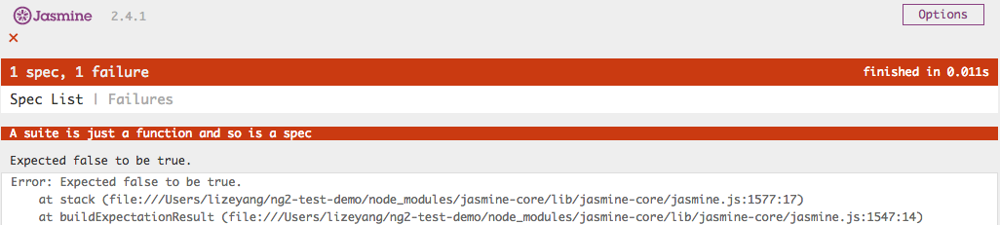
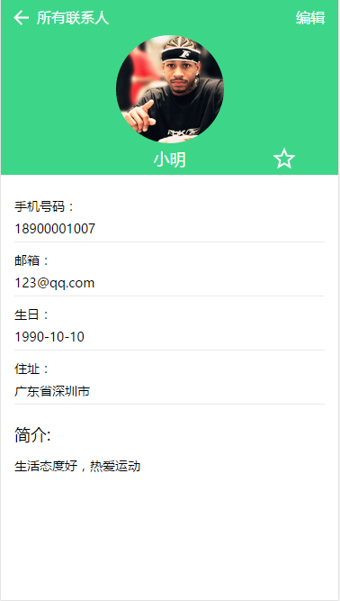

通过前面章节的学习，相信你已经掌握用Angular开发一个应用的语法及基本技能。一个应用，仅仅只是开发好了，是远远不够的，还需要有稳定的质量及快速迭代开发的能力。此时，你需要进一步学习测试技术及相关工具，以保证应用的质量。从Angular1.x 到 Angular 2，Angular团队都非常重视可测性，通过Angular构建的应用，可以更加游刃有余地编写单元测试及集成测试代码，同时，业界也有丰富、开源的测试框架，有效地提高了测试生产力。本章就将为你介绍测试相关的内容。

# 8.1 概述

#### 为什么要测试

毫无疑问，任何代码都需要良好的测试。对于一个应用来说，其意义体现在：

- 应用如果没有稳定的质量，bug层出不穷，很容易让用户失去使用的兴趣，从而失去用户的口碑。
- 在开发过程中，如果能辅以合理高效的测试手段，将事半功倍，提升开发效率，例如，可以通过持续集成＋自动测试的方式，及时暴露每日新代码的缺陷；代码重构后，可以迅速进行功能验证。
- 完备的测试代码，对于项目来说，是天然、优秀的说明文档。项目新加入的开发同事，通过阅读测试代码，可以很清楚地了解各个功能模块的关系、逻辑、调用方式。

#### 概念：单元测试、端对端测试

无论在哪种编程语言下开发，最基本的测试无非两种，一种为单元测试，另外一种则为端到端（e2e，集成）测试。

单元测试，顾名思义，就是对程序中的某个单元做测试，这里所指的单元，往往是指一段代码，一个函数等等，而非一个大型的功能集合。而端到端测试，可以简单概括为“模拟用户视角”进行测试，模拟用户行为进行测试，用户会怎么用这个系统，你就怎么测，当然，为了测试的全面性，测试往往覆盖并超过大部分用户的使用路径。

#### Angular测试技术及工具一览

工欲善其事，必先利其器。适用于Javascript的测试框架有很多，常见的包括mocha、jasmine、qunit等。不过无需担心”选择恐惧症”问题，这些框架，其实都非常相似，Angular团队推荐采用jasmine。另外，为了更好地管理测试工程，在浏览器上运行用例，还需要引入类似karma这种测试过程管理工具。对于端对端测试，则推荐使用Protractor。下面的章节，将主要介绍 Karma 、Jasmine 、Protractor的基本使用方式，以及如何结合Angular写测试代码。

> 本章的探讨方向是如何写好测试代码，也就是自动化测试，而非传统的手工测试。因此，内容基本也是围绕一些测试框架展开。手工测试相关的技术，不在本章的讨论范围。

# 8.2 单元测试

## 8.2.1 介绍

#### 单元测试解决的问题

诚如前文所述，单元测试一般都是对程序中某个独立、小型的代码块进行测试，它可以是一个函数，一个类，而非一个完整的系统。单元测试通常是由开发人员负责，以便在开发、重构过程中及时发现程序中的bug。

单元测试是研发过程中必不可少的一个环节，这里列举单元测试帮助解决的一些问题

1. 帮助开发人员在更早的阶段（开发、甚至是架构设计阶段）发现问题，而越早发现问题，往往也意味着越小的问题修复成本。
2. 解决代码重构的后顾之忧。可以快速、反复地对bug、代码逻辑进行验证，提高代码重构后验证逻辑的效率。
3. 良好的单元测试，也是天然、上佳的软件文档，很多开源项目中，测试代码都是必不可少的一部分，一方面这是项目复杂度高的必然要求，另一方面，测试代码也可以帮助众多开发者了解项目。
4. 单元测试帮助我们从另一个角度审查所开发的代码，一个项目，如果写单元测试代码时捉襟见肘，处处受限，往往也意味着项目本身的代码可测性不好，解藕程度不够，设计需要进一步优化。

> 下面的8.2.2及8.2.3小节，将抛开Angular ，向Javascript开发者介绍如何使用Jasmine及Karma。8.2.4小节，则将结合Angular进行介绍。如果你已经比较熟悉Jasmine及Karma，也可以选择跳过8.2.2及8.2.3小节。

####实践建议

在热火朝天地学习Angular测试前，先讨论怎样的单元测试，是可持续维护、高质量的单元测试代码。建议可以遵从以下规则：

1. 尽量将代码切分成小的可测单元

   这要求项目中的代码，逻辑、分层都要足够清晰。所幸，你用的是Angular！Angular从设计之初就追求可测性，按照Angular规范写的代码，往往都是可测性较好的组件，因此，单元测试需要对这些组件都进行测试。

2. 尽量只测试公开接口

   这样可以保证，被测代码的变更，不会轻易影响到测试代码。当代码实现细节、私有接口发生改变时，单元测试依然是跑得通的（也许会跑失败，不过这不正是单元测试的作用之一，代码重构后迅速发现问题）。这也能使单元测试代码成为天然的文档，当别人阅读单元测试代时，就能知道如何正确地使用对应的组件。

3. 多运行单元测试

   写了单元测试，就要多运行，确保单元测试时是能正常运行的，而且在测试失败时，能给出足够的信息帮助调试者定位问题

## 8.2.2 常用的测试框架

单元测试说简单点，就是验证被测的单元，在不同的输入条件下，执行的结果是否和预期一致。就像使用Angular作为web框架，以提高开发效率一样。这时候，往往需要测试框架来提高写单元测试的效率，帮助开发人员快速验证输出是否符合预期。当用例规模逐步增大时，测试工程会面临更多问题：需要将用例进行分组，以方便管理；能够快速运行测试用例，然后以一个友好的界面展示测试的结果，覆盖率等等。Javascript的世界里，相关的测试框架及工具也非常强大，下面，就进入本章的正题，学习如何结合框架、工具，编写测试代码！

#### Jasmine

Jasmine是一款行为驱动的测试开发框架，可以用来测试任意的Javascript代码。也就是说，无论是Web项目，还是Node后台项目，都可以用Jasmine来写测试代码。测试代码，无非就是通过代码指定一系列输入，然后再判断输出是否满足预期。Jasmine提供灵活强大的语法，让这些代码的编写更加简单。Jasmine也是Angular团队推荐的一个测试框架，Angular甚至基于Jasmine扩展了一套测试语法，集成在@angular/core包中(后面将介绍)

##### 安装

1. 安装Node.js及npm
2. 建好项目目录，并安装Jasmine核心库
```shell
npm install jasmine-core --save-dev
```

> `--save-dev`表示将jasmine-core配置到package.json的devDependencies中，这个包只是在开发时安装；与之对应的`--save` 则表示在生产模式下安装，产品在最终发布打包时也要带上这些包。

##### 第一个例子

安装好`jasmine-core`后，当前路径会生成子目录node_modules/jasmine-core。创建一个空的html，命名为test.html ，然后输入以下内容：

```html
<!DOCTYPE html>
<html lang="en">
<head>
  <meta charset="UTF-8">
  <title>NG2 单元测试</title>
  <link rel="stylesheet" href="node_modules/jasmine-core/lib/jasmine-core/jasmine.css">
  <script src="node_modules/jasmine-core/lib/jasmine-core/jasmine.js"></script>
  <script src="node_modules/jasmine-core/lib/jasmine-core/jasmine-html.js"></script>
  <script src="node_modules/jasmine-core/lib/jasmine-core/boot.js"></script>
</head>
<body>
  <script>
    //一个简单的测试代码
    describe("A suite is just a function" ， function() {
      var a;
      it("and so is a spec" ， function() {
        a = true;
        expect(a).toBe(true);
      });
    });
  </script>
</body>
</html>
```

test.html展示了一个最简单的例子，用浏览器打开这个html文件，将执行html中的测试代码，你将看到如下界面，也就是这个测试用例的执行结果。

 

图 2.8-1 jasmine执行用例成功	

现在再展示测试出错的情形：把例子中的`a=true`改成`a=false`，此时刷新test.html页面，显示出错页面如下所示： 

图 2.8-2 jasmine执行用例失败

这段示例代码短小精悍地展示了写单元测试用例的基本步骤：

1. 在`head`标签中，需要引入了3个js文件和1个css文件。这是Jasmine的库文件。
2. 每个用例用`it()`函数定义，该函数的第一个参数表示该用例的名称，第二个参数则为测试的细节。
3. 在`it()`函数中，需要用`expect`断言函数来判定测试结果，例如，`expect(a).toBe(true)` 表示变量`a`应等于true，否则，则说明这个用例测试失败。
4. 在jasmine中，将测试功能相似的一组用例称为一个测试集，并通过`describe`函数标识，假设被测类有多个函数，因此，需编写多个测试用例，这些测试用例测试的是同一个类，因此可以归为一组测试集，应将这些测试用例都放在同个`describ`函数中。
5. 单元测试用例也是写js，特别之处在于，需要用`describe`定义测试集，用`it`定义测试用例，用`expect`断言函数判定结果。

##### 内置匹配器

匹配器，就是跟在expect()函数后面，判定结果是否符合期望值的函数。在前面的例子中，已经用到了一个很常用的匹配器`toBe()`。下面展示常见匹配器及其用法：

1. `toBe()`本质是使用操作符===来比较结果值和期望值，`not.toBe()`则表示 不等

   ```javascript
   it("The 'toBe' matcher compares with ===" ， function() {
        var a = 15;
        var b = a;

        expect(a).toBe(b);
        expect(a).not.toBe(null);
     });
   ```

2. `toEqual()`用于比较两个对象，可以是自定义的对象类型（如下面的例子），也可以是数字、字符串等等。

   ```javascript
   it("should work for objects" ， function() {
         var foo = {
           a: 8 ，
           b: 15
         };
         var bar = {
           a: 8 ，
           b: 15
         };
         expect(foo).toEqual(bar);
    });
   ```

3. `toMatch()`用于验证是否匹配正则表达式

   ```javascript
     it("The 'toMatch' matcher is for regular expressions" ， function() {
       var message = "Angular is good";

       expect(message).toMatch(/Angular/);
       expect(message).toMatch("Angular");
       expect(message).not.toMatch(/bad/);
     });
   ```

4. `toContain()`用于验证数组是否包含指定元素

   ```javascript
     it("The 'toContain' matcher is for finding an item in an Array" ， function() {
       var a = ["Angular" ， "React" ， "jQuery"];

       expect(a).toContain("Angular");
       expect(a).not.toContain("Java");
     });
   ```


为了方便读者查阅，将jasmine提供的匹配器整理如下：

表 2.8-1 jasmine内置匹配器

| 匹配器          | 作用                                       |
| :----------- | :--------------------------------------- |
| toBe         | 使用===比较结果                                |
| toEqual      | 比较是否相等                                   |
| toMatch      | 正则表达式匹配                                  |
| toBeNull     | 验证是否为null                                |
| toBeTruthy   | 验证是否为`true`，反之`toBeFalsy`验证是否为`false`    |
| toBeLessThan | 验证结果是否小于指定值，反之用`toBeGreaterThan()`验证结果是否大于指定值 |
| toContain    | 验证数组是否包含指定元素                             |
| toBeCloseTo  | 将值进行四舍五入后比较是否相等，如 toBeCloseTo(e ， 2)，数字2表示数字精度 |
| toThrow      | 验证函数是否抛出一个错误                             |
| toThrowError | 验证函数是否抛出指定的错误                            |
| toBeDefined  | 验证对象是否不为为`undefined`                     |

##### 初始化函数

另外，在测试时，还会经常用到`beforeEach`,`afterEach`这两个函数，用于定义每个用例执行前及执行后的公共逻辑：

- `beforeEach()`：定义了每个用例在执行前，所需要执行的初始化函数
- `afterEach()`:每个用例在执行结束后，均将执行`afterEach()`函数

#### Karma

Karma是一个基于Node.js 的 JavaScript 测试执行过程管理工具(Test Runner)，也是由Google Angular团队出品。

 它主要带来了这些强大的特性：

- 在真实浏览器上测试。前端测试的一个目标，就是关注代码在不同浏览器的表现，检查是否有兼容性问题。Karma可以同时启动chrome、safari等不同的浏览器，并在一个浏览器窗口展示各个浏览器的测试结果。
- 当代码更新时，自动触发测试。在开发过程中，如果被测代码或者测试代码发生了变更，就能自动触发测试，这样新代码能马上得到自动验证，而且不用在多个编辑区、窗口之间切换。
- 丰富的插件支持。借由karma的各类插件，可以很方便地扩展功能，如生成友好的覆盖率报告、webpack、system.js代码打包等等。

对于几个测试用例的小demo工程，karma也许显得大材小用，但随着项目规模逐渐变大，一款值得信赖，强大的测试管理工具，将为你解决编写测试代码之外的很多烦心之事。

关于karma的更多用法，将在下面的8.2.3小节，结合jasmine进行介绍：

## 8.2.3 karma+jasmine的简单示例

为了帮助读者快速理解、结合karma及jasmine进行测试，这里将展示一个简单的例子

##### 1.安装karma

在系统全局安装karma，这样才能在命令行窗口下执行karma命令

```shell
npm install -g karma-cli
#安装karma
npm install -g karma
#本章会讲如何结合jasmine进行测试，因此需要安装jasmine相关插件
npm install -g karma-jasmine karma-chrome-launcher
```

##### 2.初始化karma.conf.js

在项目根目录下执行以下命令

```shell
karma init
```

这个命令将启动karma的配置生成器，生成器将依次询问要使用的配置。此时简单处理，可以一直按回车键，使用默认配置即可，最终将在本地生成karma.conf.js。相关界面如下图所示

 

图 2.8-3 karma配置生成界面

##### 3.配置、安装依赖

在根目录创建package.json，然后填入以下内容

```json
{
  "name": "test" ，
  "scripts": {
    "test": "karma start karma.conf.js"
  } ，
  "devDependencies": {
    "jasmine": "^2.4.1" ，
    "jasmine-core": "^2.4.1" ，
    "karma": "^1.1.0" ，
    "karma-chrome-launcher": "^1.0.1" ，
    "karma-jasmine": "^1.0.2"
  }
}
```

这是一个简单的配置文件，用于通过npm管理项目、配置依赖，其中：

- `"test": "karma start karma.conf.js"`表示为`karma start karma.conf.js`命令创建了一个别名`npm test`，运行 `npm test`等于运行｀karma start karma.conf.js｀
- devDependencies中则为karma及jasmine的依赖包

然后执行`npm install`安装package.json上指定的依赖包

> 前面章节已经介绍过package.json，每一个使用npm来管理依赖包的工程，都会存在这个文件

##### 4.写测试用例

在根目录创建一个被测代码文件，命名为src.js，这个js包含了一个简单的函数，验证参数是否为string类型

```javascript
function isString(s){
   return typeof(s) === "string";
}
```

在同级目录创建一个测试用例文件，命名为test.js，然后输入以下内容

```javascript
describe("A suite of string util" ， function() {
    it("is string" ，function(){
        expect(isString("ss")).toBeTruthy();
        expect(isString(1)).toBeFalsy();
    });
});
```
> `describe`, `it`, `expect`均为jasmine的内置函数

##### 将测试代码路径加到karma.conf

在karma.conf.js中配置测试及被测代码的路径，这里可以用通配符的方式，新加入配置如下：

```json
files: [
	'*.js'
] ，
```

修改后的karma.conf.js如下所示

```json
module.exports = function(config) {
  config.set({
    basePath: '' ，
    frameworks: ['jasmine'] ，
    files: ['*.js'] ，
    exclude: [] ，
    preprocessors: {} ，
    reporters: ['progress'] ，
    port: 9876 ，
    colors: true ，
    logLevel: config.LOG_INFO ，
    autoWatch: true ，
    browsers: ['Chrome'] ，
    singleRun: false ，
    concurrency: Infinity
  })
}
```

[TODO]: 加注释解释各个参数的作用

上面是一段经典的karma配置，其中需要理解的配置项包括：

`frameworks: ['jasmine']`指定了使用`jasmine`作为测试框架

`browsers: ['Chrome']` 表示在chrome浏览器上运行测试用例。你也可以指定其它浏览器，如safari等等

`files: ['*.js']:` 指定了测试和被测代码的路径。因为本例中的测试及被测代码，文件名后缀均为.js，且都放在根目录上。因此`['*.js']`这个配置，将使karma引入这两个文件，并执行其中的测试用例。

##### 5.运行测试用例

最后，执行`npm test`命令，karma将自动打开一个chrome浏览器，显示以下内容：

 

图 2.8-4 浏览器启动karma

命令行窗口将按执行顺序，显示以下信息，在最后一行，可以看到成功执行了一个用例，结果为SUCCESS(成功)


图 2.8-5 karma执行结果

综上所述，配置一个karma＋jasmine的“测试全家桶套餐”，只需要：

1. 安装karma并通过`karma init`命令初始化karma配置文件
2. 往package.json添加karma及jasmine依赖
3. 用jasmine语法写测试用例

## 8.2.4 Angular 下的单元测试

在前文中，已经提到，无论是angularjs1.x，还是Angular，都特别注重可测性。在Angular中，组件化、依赖注入、使用ES6特性等设计理念，使其单元测试更加便捷。对Angular的程序进行单元测试，主要需学习：

1. 首先，angular app下的每个组件，都是一个个JS类（ class ClassName {xxx})，而不是像老旧的web项目一样，都是一堆松散的function。因此，你可以像测试普通js代码一样（或者更准确地说，普通的js 类），测试js 类中的逻辑：在测试代码中初始化被测类，然后调用被测类中的函数，验证函数返回值。
2. 其次，需要学习Angular团队提供的测试工具组件。为了更好的测试compoent中的交互、展示逻辑，也许你需要学习使用`TestComponentBuilder` ，为了更好的测试servcie，解决依赖注入的问题，还需要学习使用`addProviders`注入测试代码中需要引用的service，使用`async`api验证耗时的异步请求，学习如何mock service。
3. 最后，还需要学习项目的前端打包工具如何与karma结合。有些项目可能用了webpack，有些可能是用system.js。打包工具不同，对应的karma配置也有所不同，良好的配置有助于构建一个完整、可持续维护的测试工程。


图 2.8-6 Angular测试需掌握的知识

接下来，将结合通讯录demo，逐步介绍如何测试一个Angular应用，在通讯录的demo中，有一个通讯录详情页，它将通过 ContactService 获取源数据，然后由ContactDetail（组件）负责渲染数据到对应的模板中：

 

图 2.8-7 通讯录demo-联系人详情页面

### 测试工程环境准备

#### package.json配置及karma配置

package.json及karma.conf.js基本配置，在前面“8.2.3 karmai+jasmine的简单示例”一节中，已经介绍过。这里不再赘述。这里主要介绍webpack相关内容。

由于通讯录demo采用了webpack打包，因此需要结合webpack配置，修改karma.config.js。

下面展示了修改后的karma.config.js文件。主要是告诉karma需要引用webpack进行打包。其中：

- ./webpack.config指的是项目本身的webpack配置。
- karma-shim.js是新创建的配置文件，用于编译测试代码及配置测试参数。
- preprocessors，预处理器，这里的作用是使用webpack编译测试代码。
- proxies: { "/app/": "http://localhost:3000/app/" }，将/app/目录重定向为启动后的http地址，否则会存在找不到html模板、css文件等问题

```javascript
var webpackConfig = require('./webpack.config');
module.exports = function(config) {
  config.set({
  	//……省略了初始化生成的配置
    files: [
      { pattern: './karma-shim.js' ， watched: false }
    ] ，
    preprocessors: {
      './karma-shim.js': ['webpack']
    } ，
    webpack: webpackConfig ，
    plugins : [
      'karma-jasmine' ，
      'karma-chrome-launcher' ，
      require("karma-webpack")
    ] ，
    proxies: {
      "/app/": "http://localhost:3000/app/"
    }
  })
}
```

下面为karma-shim.js文件

```javascript
Error.stackTraceLimit = Infinity;

//引入编译时所需的库文件
require('es6-shim');
require('reflect-metadata');
require('zone.js/dist/zone');
require('zone.js/dist/long-stack-trace-zone');
require('zone.js/dist/jasmine-patch');
require('zone.js/dist/async-test');
require('zone.js/dist/fake-async-test');

//打包文件名后缀为spec.ts的测试代码
var appContext = require.context('./src' ， true ， /\.spec\.ts/);
appContext.keys().forEach(appContext);

//适用angular自身的测试组件替代jasmine
var testing = require('@angular/core/testing');
var browser = require('@angular/platform-browser-dynamic/testing');
testing.setBaseTestProviders(browser.TEST_BROWSER_DYNAMIC_PLATFORM_PROVIDERS ， browser.TEST_BROWSER_DYNAMIC_APPLICATION_PROVIDERS);
```

［todo：web pack.config.js需要去掉new webpack.optimize.CommonsChunkPlugin才能编译，why］

#### 约定

测试代码，是和被测代码放在同个层级目录，还是创建一个独立的test目录，这是个见仁见智的问题。建议遵守一个约定：保持和被测组件相同的名字前缀，然后加上spec或者test等字符串以标示其为测试代码。例如，假设被测的代码文件名为contact-list.ts，则对应的测试用例文件名可以为contact-list.spec.ts。

### 组件测试

让我们先从最简单的开始，测试简化版的contact-detail.ts。

contact-detail.ts如下所示：

```
import {Component} from '@angular/core';

@Component({
  selector: 'detail',
  templateUrl: 'app/components/contact-detail/contact-detail.html',
  styleUrls: ['app/components/contact-detail/contact-detail.css'],
})
export class ContactDetail {

  detail:any = {};
  
  getById(id:number) {
      this.detail = {
        "id": 1,
        "name": "张三",
        "telNum": "18900001001",
        "address": "广东省深圳市",
        "email": "123@qq.com",
        "birthday": "1990/10/10",
        "collection": 1
      };
  }
  
}
```

contact-detail.html如下所示：

```
<div class="detail-contain">
  <ul class="detail-info">
    <li id="test">
      <p>手机号码：</p>
      <p>{{ detail.telNum }}</p>
    </li>
    <li>
      <p>邮箱：</p>
      <p>{{ detail.email }}</p>
    </li>
    <li>
      <p>生日：</p>
      <p>{{ detail.birthday}}</p>
    </li>
    <li>
      <p>住址：</p>
      <p>{{ detail.address }}</p>
    </li>
  </ul>
</div>
```

可以看到，这是一个很简单的例子，不包含路由，服务，管道等其他元素，这意味着还不用考虑依赖注入、响应耗时、mock 服务等问题。在ts代码中，通过`getById`方法，将固定不变的数据赋值给变量detail，之后html将获取detail的内容，渲染到页面中。

component是Angular app中最重要的组成部份。每一个compoent，本质都是JSL类，因此，测试一个简单的component，跟测试普通的javascript 类没什么不同。

对应到这个例子，测试代码如下，先通过new方法初始化一个对应的类，然后验证类的私有变量detail是否等于预期值：

```
import {ContactDetail } from './contact-detail';

//这个例子测试了一个最简单的compoent
describe('contact-detail compoent', () => {

  //步骤1
  beforeEach(() => {
    this.component = new ContactDetail();
  });

  //步骤2
  it('test simple compoent',() => {
    this.component.getById(1);
    expect(this.component.detail.name).toEqual("张三");
  });

});
```

> `beforeEach`函数，就是在每个用例执行前，都要执行的通用逻辑

这个过程，跟测试普通的JS类没有差别。之后，如果被测类中新增一个函数，也是同样的测试方式，例如新增了`getTelCity()`函数，那么对应的测试代码可以是:

 `expect(this.component.getTelCity()).toBe('xxxx')`

> 假设被测compoent依赖于其它组件，在测试代码中，还需要注入对应的组件，具体方式，下面会介绍

除了通过new的方式初始化被测类，还可以基于依赖注入的方式，初始化被测的组件／服务，例如，上面的测试代码，和如下的测试代码，作用是一样的：

```
import {ContactDetail } from './contact-detail';
import {
  inject,
  TestBed
} from '@angular/core/testing';

//这个例子测试了一个最简单的compoent
describe('contact-detail compoent', () => {

  //通过依赖注入的方式,注入被测类
  beforeEach(() => {
    TestBed.configureTestingModule({
      providers: [ContactDetail]
    });
  });

  it('test simple compoent2',inject([ContactDetail], (component) => {
    component.getById(1);
    expect(component.detail.name).toEqual("张三");
  }));

});
```

其中：

- `it()`函数中的`inject([ContactDetail], (component)=>{})`，表示在测试代码中需要引用ContactDetail，对应的变量名为`component`。
-  `TestBed.configureTestingModule({providers: [ContactDetail]})`表示需要注入`ContactDetail` 
- `TestBed`是Angular提供的测试组件，提供了一系列api，帮助开发构建测试的上下文环境，解决依赖注入等问题。

另外，注意这里引入了Angular自己定义的测试组件。随着测试的深入，还会引入越来越多的Angular自定义组件，例如：

```javascript
import {
  inject,
  async,
  fakeAsync,
  tick,
  ComponentFixture,
  TestBed
} from '@angular/core/testing';
```

因为Angular的测试需求，jasmine无法完全满足，因此Angular团队在Jasmine基础上做了扩展，实现了一套测试工具组件。Jasmine原有的`it`,`beforeEach`,`expect`等函数和Angular测试组件可以兼容并存。

#### 组件交互测试

上面只是介绍了测试组件 类的方式，更多复杂的测试需求，例如测试测试html输出，具体的交互逻辑，都得借助`TestBed`实现。

顾名思义，TestBed，作用在于帮助开发者测试component，通过它可以初始化被测组件，并获取用于测试component的上下文环境。

在下面的例子中，通过`TestBed.createComponent`初始化了被测组件`ContactDetail`，然后可以拿到组件对应的dom元素，并检查dom元素的内容。

```javascript
import {ContactDetail } from './contact-detail';
import {
  inject,
  TestBed,
  ComponentFixture,
  async
} from '@angular/core/testing';

describe('contact-detail compoent', () => {

  beforeEach(() => {  
    TestBed.configureTestingModule({
      declarations: [ContactDetail]
    });
  });
  
  beforeEach(async(() => {
  	TestBed.compileComponents();
  }));

  it('test simple compoent with TestComponentBuilder', async(() => {
    var fixture = TestBed.createComponent(ContactDetail);
    var compiled = fixture.debugElement.nativeElement;//拿到的是一个原生dom元素,querySelector也是原生方法http://www.w3school.com.cn/jsref/dom_obj_all.asp
    fixture.componentInstance.getById();
    fixture.detectChanges();//类似angular1的digst
    expect(compiled.querySelector('.detail-info>li:first-child>p:nth-child(2)').textContent).toBe('18900001001');//CSS选择器    
  }));
[TODO:例子中还有些要说明的内容]
});
```

在上面的例子中，需要理解的内容包括：

- TestBed的api`createComponent`用于初始化被测的组件，并创建ComponentFixture对象，这个对象可以认为是被测组件的上下文环境，通过它，可以获取初始化好的组件实例，dom元素等等。
- fixture.detectChanges()用于触发js变量及模版内容的变更。组件初始化、dom元素变更、js值变化时，都需要调用这个方法，以便触发双向绑定的地方做对应变更（todo:还不是特别明确这个的作用）
- fixture.debugElement.nativeElement：获取组件对应的原生dom元素，也之后可以通过`querySelector`等dom元素原生api做进一步处理。
- fixture.debugElement.componentInstance：获取组件对应的js实例，例如假设被测类存在内部变量greeting时，则可以通过`fixture.debugElement.componentInstance.greeting`访问、修改该变量。


#### 组件测试的更多技巧

- 触发点击事件：cfixture.debugElement.nativeElement.querySelector('button').click()，如例子所示，将获取button子元素，并触发click事件。


- 替换模版`TestBed.overrideComponent`:可以通过这个api，在初始化组件时，根据测试需要替换为其它模版。

  ```javascript
  TestBed.overrideComponent(ContactDetail, {set: {template: `<span>Foo<span>`
        }}).compileComponents().then(() => {//测试逻辑 });
  ```

- 自定义匹配器

  在上面的例子中，`compiled.querySelector('.detail-info>li:first-child>p:nth-child(2)`这个选择器非常蹩脚，如果我们想偷懒，只是简单验证渲染的页面内容中是否包含了指定文字，而不用指定具体的元素呢？

  显然，我们可以拿到dom.textContent.indexOf的方式，来进行判断，为了之后的复用更加方便，可以通过jasmine的 `addMatchers`方法进行扩展，例如下面的示例中，扩展了一个函数，用于检测目标元素中是否包含指定的文本信息：

```javascript
beforeEach(() => {
    jasmine.addMatchers({
        toContainText: function() {
            return {
                compare: function(actual ， expectedText) {
                    var actualText = actual.textContent;
                    return {
                        pass: actualText.indexOf(expectedText) > -1 ，
                        get message() { return 'Expected ' + actualText + ' to contain ' + expectedText; }
                    };
                }
            };
        }
    });
});
```

​	有了这个匹配器之后，可以这样使用：

```
var compiled = fixture.debugElement.nativeElement;
fixture.componentInstance.getById();
fixture.detectChanges();
expect(compiled).toContainText('18900001001');//扩展addMatchers
```

#### 在组件中使用服务

现在，你已经学会测试一个不依赖于service的compent。但现实中，compoent中往往还会依赖service，例如，改造之前的compent，通过service获取`detail`信息：

```
export class ContactDetail {

  detail:any = {};

  constructor(
    private _constactService:ContactService
  ){}

  getById(id:number) {
    this.detail = this._constactService.getContactById(id);
  }
  
}
```

此时，测试代码也要相应更新，注入ContactService（其他地方保持不变）：

```
beforeEach(() => {
  addProviders([ContactDetail,ContactService]);
});
```

#### Mock 服务

在单元测试中，经常会遇到的一个问题，就是mock。所谓mock，就是构造一个虚拟对象或者数据，来代替真实的对象，以方便对测试代码中真正关注的对象进行测试，例如，`ContactDetail`的函数中调用了`ContactService`，而在`ContactDetail`的单元测试中，关心的是`ContactService`本身的逻辑，`ContactService`的逻辑反而成了写测试逻辑的阻碍，假设`ContactService`中需要进行http调用，那对于测试结果、耗时都是不可控的，因此，我们希望可以方便地模拟`ContactService`的返回值，通过mock的方式，就可以达到这个目的，从而专注地测试`ContactService`的逻辑。


图 2.8-8 mock服务 示意图

方法如下：

1. 先在测试代码中写一个Mock 服务

```javascript
   class MockContactService extends ContactService {
     getContactById(id:number) {
       return  {
         "name": "张三1"
       };
     }
   }
```

2. 然后声明使用mock 服务

```
  beforeEach(() => {
    TestBed.configureTestingModule({
      providers: [
      	provide(ContactService, { useClass: MockContactService }),
        ContactDetail
      ]
    });
  });
```

如此一来，被测代码执行时，当需要用到ContactService.getContactById方法时，调用的，均是mock service，而不是原先的被测代码。

### 服务测试

服务的测试，也是比较简单的。在上面的例子中，已经介绍过ContactService,这个服务目前。只有一个函数getContactById。测试代码如下：

```
beforeEach(()=> {
   TestBed.configureTestingModule({
        providers: [ContactService]
   });
});
it('test getContactById', inject([ContactService], (service) => {
  expect(service.getContactById(1)["name"]).toBe("张三");
}));
```

和前面介绍的，测试简单组件的方式没有不同。

但现实中的service，也不像前面的例子那么简单，往往还会包含http请求、异步操作等。现在将service改造成异步请求，等待1秒，才返回数据，以模拟现实中的网络请求耗时：

```
getContactById(id:number) {

  return new Promise((resolve, reject) => {
    setTimeout(() => {
        resolve({
          "id": 1,
          "name": "张三",
          "telNum": "18900001001",
          "address": "广东省深圳市",
          "email": "123@qq.com",
          "birthday": "1990/10/10",
          "collection": 1
        });
    }, 1000);
  });

}
```

这时会发现，原先的测试用例已经失效。这是因为原先的测试代码，获取的是Promise延迟对象，而非真正的数据，真正的数据，需要1秒之后才返回。这时，我们尝试将测试代码改成：

```
service.getContactById(1).then((result) => {
  expect(result["name"]).toEqual("张三");
})
```

此时执行用例，不报错了，但不要高兴得太早，不报错是因为测试代码并没有真正执行expect方法，这样写是不对的，正确的做法，是要引入`async`函数，同时，这个函数，还支持定义超时时间，当执行时间超过指定值时，则测试失败。代码如下：

```
it('test getContactById promise' ,async(inject([ContactService] , (service) => {
  service.getContactById(1).then((result) => {
    expect(result["name"]).toEqual("张三");
  })
})),3000);
```

当用例代码被包裹在`async`函数时，测试将会在所有的异步请求都执行结束时，才自动结束。因此，像上面的例子中，在异步请求`getContactById`返回结果前，测试框架将进入等待状态，直到该请求返回结果。同时，这里我们设置了超时时间3000毫秒，如果用例在3000毫秒内未执行结束，测试结果也将为失败。

接下来我们再往service中增加一个方法，用于根据电话号码获取电话城市：

```
export class ContactService {
  //这里省略了getContactById()
  getTelCity(id:number){
    return new Promise((resolve, reject) => {
      setTimeout(() => {
        if(id == 18900001001) {
          resolve("深圳");
        }else{
          resolve("未知城市");
        }
      }, 1000);
    });
  }
}
```

在测试代码中，需要先获取通讯录信息，然后再根据其中的电话号码获取该号码所在城市，代码如下：

```
service.getContactById(1).then((result) => {
  expect(result["name"]).toEqual("张三");

  service.getTelCity(result.telNum).then((result) => {
    expect(result).toEqual("深圳1");
  });
})
```

这种回调中加回调的代码，可读性不好，是一种不好的测试代码。那么，是否能进行优化了，angular还提供了另外一个函数`fakeAsync`，功能和`async`函数相似，都可以用来测试异步请求，但`fakeAsync`的神奇之处在于，它可以将异步请求模拟成同步请求，因此，测试代码也不用像上面一样，在回调函数中进行嵌套。其对应的测试代码如下：

```
it('test getContactById promise with fakeAsync' ,fakeAsync(inject([ContactService] , (service) => {

  var contactInfo;
  var telCity;

  service.getContactById(1).then((result) => {
    contactInfo = result;
  });

  tick(1200);

  service.getTelCity(contactInfo.telNum).then((result) => {
    telCity = result;
  });

  tick(1200);

  expect(contactInfo["name"]).toEqual("张三");
  expect(telCity).toEqual("深圳");


})));
```

### 管道测试

同组件一样，管理本质上也是一个JS类，所以测试管道的方法，跟测试普通的JS类也没有差别。例如，在通讯录demo中，有一个pipe如下所示，用于转换时间格式：

```javascript
import { Pipe, PipeTransform } from '@angular/core';

@Pipe({
  name: 'dateReform'
})
export class DateReform implements PipeTransform {
  transform(val:string, format:string):string {
    //省略具体逻辑

    return result;
  }
}
```

那么，对应的测试代码如下

```javascript
import {DateReform } from './date-reform.pipe';

describe('test datereform', () => {

  beforeEach(()=> {
    this.pipe = new DateReform();
  });
  it('transforms datetype', () => {
    expect(this.pipe.transform('1990/10/10','yyyy-MM-dd')).toEqual('1990-10-10');
  });

});
```

[todo]有时间还要加路由、rxjshttp请求测试

# 8.3 端对端测试

端对端测试（End to End Test ）从另一个角度理解，就是模拟用户行为进行测试，例如，通过测试代码模拟用户的行为：打开某个网页，点击指定按钮，是否如预期一样弹出了一个框，或者跳转到另外一个页面；提交了一个form表单后，是否弹框提示了正确的信息。由于它是模拟用户行为的一种测试，所以往往更耗时，测试的效率会低于单元测试，也正因如此，写测试代码，更多时候会倾向于单元测试而非端对端测试。

尽管如此，作为测试手段的丰富及补充，开发者仍需要了解如何进行端对端测试，并在合适的场景下使用端对端测试。

下面，将介绍如何使用Protractor搭建端对端的测试环境、编写测试用例。

## 8.3.1 Protractor简介

Protractor是一个专门为angular设计的端对端测试框架。Protractor提供了一系列的api，帮助我们编写端对端的测试用例，它可以启动一个真实的浏览器进行测试。Protractor默认使用Jasmine测试框架，掌握了Jasmine的基本语法后，只需再学习Protractor提供的几个api，就可以很方便地编写端对端的测试用例。

## 8.3.2 安装

安装分为两部分

首先，请在全局安装protractor

```shell
npm install -g protractor
```

接着，请执行以下命令以安装Selenium Server

```shell
webdriver-manager update
```

该命令实际会按照selenium-server和chromedriver包。Selenium Server本质是一个代理，介于测试用例和浏览器Driver之间。它的职责是将测试用例的命令转发给浏览器执行，并返回浏览器的响应给测试用例。

示意图如下：

  	

安装完之后，可以通过`webdriver-manager start`命令启动这个代理，默认地址为http://localhost:4444/wd/hub。启动成功，可以通过浏览器访问到这个网址。

## 8.3.3 第一个e2e测试用例

### 配置

在项目根目录创建一个protractor配置文件，命名为protractor.conf.js，内容如下：

```javascript
exports.config = {
    framework: 'jasmine' ，
    seleniumAddress: 'http://localhost:4444/wd/hub' ,
    specs: ['src/e2etest/example_e2etest.js'],
    useAllAngularAppRoots: true
};
```

其中：

- specs指定了测试用例文件的路径
- seleniumAddress是selenium代理地址，默认为http://localhost:4444/wd/hub
- useAllAngularAppRoots: true，支持Angular测试

### 用例代码

在src下创建一个e2etest目录，专门用于放端对端的测试用例，然后创建一个用例代码文件，可以命名为example_e2etest.js	

在下面的示例代码中，展示了一个用例：访问通讯录demo中的list页面，并点击第一个条目，前往对应详情页。

```javascript
describe('contact list', function() {
  it('should have list and can jump to detail' ,function() {

    //提前在本地启动了demo程序
    browser.get('http://localhost:3000/contact-list');

    var contactList = element.all(by.css('.list li a'));
    expect(contactList.count()).toBeGreaterThan(8);

    contactList.first().click();
    browser.getCurrentUrl().then(function(url) {
      expect(url.endsWith('contact-detail/1')).toBe(true);
    });

  });
});
```
describe、it、expect这些语法来自于Jasmine。Protractor则提供了诸如以下的api：

- 打开网页：browser.get('http://localhost:3000/contact-list') 
- 元素选择：element.all(by.css('.list li a'))将返回页面上满足css规则的元素
- 交互动作:获取元素之后，可以通过sendKeys往input框输入内容，通过click()点击元素，通过getText获取元素等等

更多api，请参考Protractor官网：http://www.protractortest.org/#/api。值得注意的是，在本书截稿之时，Protractor尚未提供 Angular的独立版本，因此，有不少只适用于angular1.x的api是不可用的。例如，对于angular1.x，Protractor提供了诸如by.repeater、by.model、by.binding等元素选择器，而对于Angular，这些都是不可用的，只有华山一条路，通过by.css，也就是css选择器来获取元素。

### 运行

要运行上面的测试用例，首先需启动webdriver-manager，该命令将会启动Selenium Server。

```shell
webdriver-manager start
```

接着，在另外一个命令行窗口执行protractor命令，参数为项目的protractor配置文件

```shell
protractor protractor.conf.js
```

运行该命令之后，默认将打开chrome浏览器，然后跳转到用例中指定的网址，并执行对应的动作、验证。命令行窗口将显示如下内容：

```shell
[16:41:49] I/launcher - Running 1 instances of WebDriver
Started
.
1 spec ， 0 failures
Finished in 3.422 seconds
[16:41:57] I/launcher - 0 instance(s) of WebDriver still running
[16:41:57] I/launcher - chrome #01 passed
```

这说明运行了1个用例，0个失败。测试成功！

# 8.4 本章小结

在本章中，先引入介绍了单元测试、端对端测试的基本概念及重要性。然后介绍了jasmine及karma的基本使用方式，并结合Angular的实际测试场景，介绍了相关组件的测试方法及实践。最后，介绍了端对端测试利器Protractor。阅读完本章之后，希望你可以掌握编写、管理单元测试及端对端测试代码的有效方法。本章仅仅是测试的基础入门，更多的测试技巧，还需要结合自己项目的实际情况逐步摸索。

当你阅读到这里时，相信你已经能开发、测试一个完整的angular app。接下来，让我们开始进入实战部分，下面将通过一个完整的demo，阐述angular相关的最佳实践。
